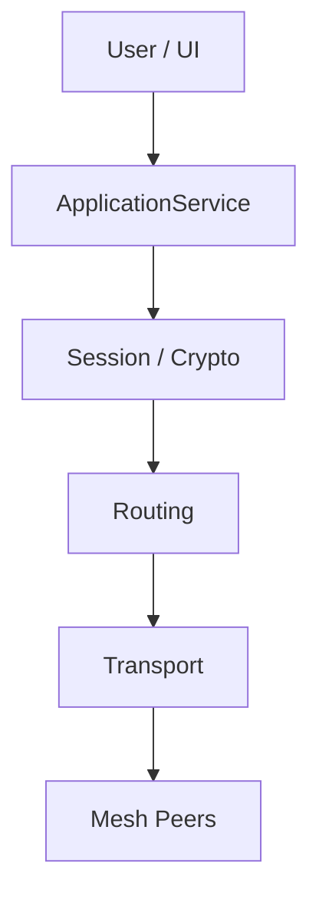
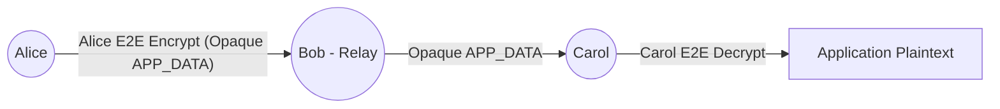

# Academic Report: Design and Implementation of an End-to-End Encrypted Messaging System over a Decentralized Mesh Network

## 1. Title Page Information
**Project Title**: Design and Implementation of an End-to-End Encrypted Messaging System over a Decentralized Mesh Network
**Project Director / Final Authority**: Sanchay Jain
**Project Overseer / Security Architect / Technical Lead**: Jarvis
**Implementation/Test Agent**: Antigravity

## 2. Abstract
This project presents the design, implementation, and evaluation of a decentralized mesh networking system providing secure, end-to-end encrypted (E2EE) messaging. Addressing the vulnerabilities of centralized architectures, the proposed system leverages bounded managed flooding for multi-hop forwarding and robust cryptographic identities. Key features include Ed25519-based cryptographic identity, X25519 key agreement, and ChaCha20-Poly1305 for authenticated session establishment and secure data transfer. The implementation underwent strict security validation, proving resilience against ciphertext tampering, identity spoofing, and replay attacks. Experimental evaluation in a controlled loopback environment demonstrated an application delivery throughput of ~1,854 messages/sec for 1KiB payloads, with mean multi-hop forwarding latencies of ~0.122 ms. Limitations include the lack of Internet-scale WAN testing, absence of global traffic-analysis resistance, and unmeasured concurrent handshake scaling, which bound the system's current deployment readiness.

## 3. Keywords
Decentralized Mesh Networking, End-to-End Encryption (E2EE), Cryptographic Identity, Bounded Managed Flooding, Authenticated Session Establishment, Multi-Hop Forwarding, Ed25519, X25519.

## 4. Introduction
Traditional messaging platforms rely on centralized infrastructure, introducing single points of failure, censorship risks, and broad trust assumptions regarding the central authority. Decentralized mesh networks mitigate these structural risks by distributing the routing workload across participating peers. This project designs a resilient, end-to-end encrypted messaging system atop a custom peer-to-peer mesh. By tightly coupling cryptographic identities with routing mechanics, the system provides confidentiality and integrity guarantees independent of intermediate forwarding nodes. 

## 5. Problem Statement
Design and implement a robust messaging system that enables end-to-end encrypted communication over a decentralized, multi-hop mesh network without relying on central servers, while mitigating localized network threats such as eavesdropping, packet tampering, and unauthorized impersonation.

## 6. Motivation
The reliance on centralized platforms places immense trust in third-party providers. In environments requiring high resilience, censorship resistance, and privacy—such as disaster recovery scenarios, ad-hoc sensor deployments, and privacy-conscious communications—a decentralized approach is essential. This project explores the architectural feasibility of securely bounding mesh network traffic while maintaining strict end-to-end cryptographic integrity.

## 7. Objectives
1. Implement a decentralized mesh network using bounded managed flooding.
2. Integrate cryptographic identities based on asymmetric cryptography (Ed25519).
3. Establish authenticated, end-to-end encrypted sessions (X25519, ChaCha20-Poly1305).
4. Route opaque ciphertext through intermediate nodes without exposing payload contents.
5. Validate security boundaries against tampering, spoofing, and replay attacks.
6. Evaluate the system's performance constraints in a controlled experimental environment.

## 8. Scope
The project focuses on the core cryptographic, transport, and routing mechanisms necessary for a secure mesh application. This includes identity generation, session negotiation, secure payload encapsulation, and duplicate-suppressed network flooding. Global traffic-analysis resistance, perfect anonymity, guaranteed message delivery, and post-compromise endpoint protection fall explicitly outside the project's scope.

## 9. Threat Model
The system mitigates local and path-based threats using cryptographic constraints, but explicitly does not guarantee absolute anonymity.

**PROTECTED / MITIGATED:**
- **Traffic Observation**: Application payloads are protected via ChaCha20-Poly1305 E2EE.
- **Ciphertext Capture & Modification**: AEAD validation rejects tampered ciphertext.
- **Replay Attacks**: Sequence-based nonces and replay windows reject duplicate packets.
- **Malformed Packets**: Semantic protobuf validation drops non-compliant structures.
- **Malicious/Intermediate Mesh Nodes**: Relays cannot decrypt `APP_DATA` or spoof `INIT`/`RESP` packets due to required cryptographic session keys and identity signatures.
- **Impersonation**: Initial handshakes are cryptographically bound to the peer's Ed25519 public key.
- **Resource Exhaustion**: Mitigated via bounded TTL, bounded seen-cache, pending-handshake limits, and forwarding queue limits.

**NOT FULLY SOLVED / OUT OF SCOPE:**
- **Perfect Anonymity & Global Traffic-Analysis Resistance**: Source/Destination metadata and packet timing can be analyzed.
- **Complete Metadata Hiding**: Packet metadata is visible to intermediate routers.
- **Deniability**: The handshake generates non-repudiable cryptographic artifacts (signatures).
- **Compromised Endpoint Protection**: The security model assumes endpoints are secure; malware on Alice's device is out of scope.
- **Guaranteed Delivery**: Flooding does not provide deterministic delivery acknowledgments over unreliable topologies.
- **Operational Deployment Readiness**: Not production-hardened for Internet-facing adversarial DoS.

## 10. System Requirements
- **Runtime**: Go 1.21+ 
- **Dependencies**: Google Protobuf, `golang.org/x/crypto/chacha20poly1305`, `golang.org/x/crypto/argon2`, `golang.org/x/crypto/hkdf`.
- **Hardware**: Standard multi-core POSIX environments (tested on AMD Ryzen 7, Linux).

## 11. Related Concepts / Background
- **End-to-End Encryption**: Ensures that intermediate nodes (including relays and service providers) cannot access plaintext data.
- **Mesh Networking**: A network topology where each node relays data for the network, cooperating in data distribution.
- **Asymmetric Cryptography**: Uses mathematically linked public/private key pairs for identity and digital signatures (e.g., Ed25519).
- **Key Agreement**: Protocols like X25519 allow two parties to safely derive a shared secret over an untrusted channel.

## 12. System Architecture



## 13. Network Architecture
The network layer relies on TCP connections established between directly connected peers. The `peerManager` oversees these connections, maintaining active `peer` objects and enforcing concurrency limits. The transport layer relies on 4-byte length-prefixed TCP framing, enforcing an absolute maximum frame size of 64 KiB.

## 14. Cryptographic Architecture
The system relies on a frozen, modern cryptographic suite:
- **Identity**: Ed25519
- **Key Agreement**: X25519
- **AEAD**: ChaCha20-Poly1305
- **KDF**: HKDF-SHA-256
- **Password KDF**: Argon2id
- **Hashing**: SHA-256

**Handshake Transcript:**
```
DOMAIN = "MeshChat-Handshake-v1"
PROTOCOL_VERSION = 0x01

T_INIT = DOMAIN || u8(PROTOCOL_VERSION) || ID_A || ID_B || E_A || ZERO32
T_RESP = DOMAIN || u8(PROTOCOL_VERSION) || ID_A || ID_B || E_A || E_B
```
Alice signs `T_INIT`; Bob signs `T_RESP`.

**Session ID**: `SHA256(T_RESP)`
**HKDF Key Derivation**:
```
salt = SHA256(T_RESP)
K_A_to_B = HKDF-Expand(PRK, "MeshChat-v1|session|initiator->responder", 32)
K_B_to_A = HKDF-Expand(PRK, "MeshChat-v1|session|responder->initiator", 32)
```

**Trust On First Use (TOFU)**: 
The system utilizes TOFU. TOFU protects against certain identity changes after initial trust is established, but first contact is not authenticated against an active MITM attacker. TOFU is not equivalent to a global PKI.

## 15. Protocol Design
Communication is defined via Protocol Buffers.
Runtime validation enforces:
- Packet sizes (≤ 64 KiB)
- Packet version matching
- Proper `oneof` consistency
- Unknown-field denial
- Bounded ciphertext limits
- Valid source identities and session binding

## 16. Mesh Routing and Forwarding
Routing is executed strictly via **Bounded Managed Flooding**, not a DHT or route-selection algorithm. 
- Packets are flooded to all peers except the origin.
- Forwarding is bounded by a strict Time-To-Live (TTL) field.
- **Duplicate Suppression**: A seen-cache tracks incoming messages using the identity tuple `(source_node, packet_id)`. The `PacketID` is strictly local to the source node and is NOT a globally unique identifier.
- **Relay Blindness**: The routing layer strictly forwards opaque `APP_DATA`. Endpoint applications handle decryption. Intermediate relays do not possess the endpoint session keys and cannot decrypt the payloads.



## 17. Application and GUI Architecture
The `ApplicationService` coordinates identity initialization, session requests, message encapsulation, and routing. The GUI (implemented in Fyne) interacts exclusively with this service layer, isolating UI logic from cryptographic and networking mechanics.

## 18. Implementation
The system is built in Go. Concurrency is managed via goroutines with strict synchronization (channels and mutexes) across peer reading/writing loops. `Router` acts as the intermediary between the network `PeerManager` and the `ApplicationService`.

## 19. Security Design
Security is implemented in layers:
- Network layer rejects payloads > 64 KiB.
- Routing layer drops expired TTLs and duplicates.
- Cryptographic layer rejects tampered `APP_DATA` using ChaCha20-Poly1305 MAC validation.
- Sequence-based nonces ensure strict chronological freshness within the sliding replay window.
- Sequence exhaustion immediately forces session rotation/failure.

## 20. Security Validation
Security was validated comprehensively in Milestones 9.2 and 9.3.
**Demonstrations**:
1. Wrong PeerID rejections.
2. Ciphertext tampering detection.
3. AEAD replay rejection.
4. Invalid signature failures during handshake.
5. Malformed packet structural drops.
6. TTL expiration enforcement.
7. PacketID duplicate suppression via seen-cache.
8. Pending-handshake bounds enforced (MaxPendingHandshakes = 10).
9. GUI validation confirming secure session generation and identity rendering.

## 21. Experimental Methodology
Controlled, local loopback experiments (M10.2) evaluated the unmodified production `meshchat` binaries and APIs. 
Metrics measured:
- **Application Delivery Throughput**: Total messages successfully arriving and decrypting.
- **Latency**: One-way application-level delivery latency, calculated from transmission start to post-decryption event triggering via synchronized `time.Since` boundaries.
- **Cryptography**: Operation latency via `testing.B`.

## 22. Experimental Results
*NOTE: These are LOCAL LOOPBACK EXPERIMENTAL RESULTS and do not represent Internet/network deployment performance.*

**Cryptography:**
- X25519: ~39.6 µs/op
- Ed25519 signing: ~20.3 µs/op
- Ed25519 verification: ~46.0 µs/op
- ChaCha20-Poly1305 encryption: ~1.9 µs/op at 4KiB.
- AEAD decryption: NOT MEASURED (Triggered replay constraints during isolated benchmark trials).

**Direct Latency:**
- 1KiB payload: Mean 0.063 ms, P99 0.220 ms.
- 4KiB payload: Mean 0.073 ms, P99 0.222 ms.

**Multi-Hop Latency (Alice → Bob → Carol):**
- 1KiB payload: Mean 0.122 ms, P99 0.408 ms.
- 4KiB payload: Mean 0.132 ms, P99 0.382 ms.

**Throughput:**
- 5,000 messages (1KiB) delivered successfully.
- Total bytes: 5,120,000 payload bytes.
- 0 loss, 0 duplicates in 2.696 seconds.
- Metric: APPLICATION DELIVERY THROUGHPUT ≈ 1,854 messages/sec (1.81 MiB/sec).

**Message Size Scaling:**
- 60KiB payloads achieved a 100/100 delivery success rate. (Note: 60KiB was the largest tested payload traversing the current frame implementation; it is not the absolute maximum).

**Resource Usage:**
- Maximum RSS: ~96 MiB.
- User CPU time: 3.08 s. System CPU time: 1.03 s. 
- CPU utilization percentage: NOT MEASURED.

**Handshake Repeatability:**
- 50 sequential handshakes passed consistently.
- Concurrent handshake scaling: NOT MEASURED.

## 23. Results and Discussion
The results demonstrate that secure application messaging operates correctly and deterministically on loopback connections. Bounded resource and concurrency controls operate alongside the messaging stack without inducing systemic failures under local test limits. Multi-hop forwarding inherently introduces measurable additional latency (e.g., 0.063 ms local direct vs. 0.122 ms local multi-hop for 1KiB payloads). The system achieved robust Application Delivery Throughput (1,854 msgs/s) locally, confirming the protocol overhead does not heavily constrain the TCP transport on high-bandwidth links. The successful traversal of 60KiB payloads demonstrates proper serialization boundaries relative to the 64 KiB framing constraint. Cryptographic operations remain negligible (microsecond scale) relative to network transmission timings.

## 24. Performance Analysis
The isolated local conditions confirm the software stack scales linearly up to the frame size and manages memory effectively (~96 MiB RSS under load).

## 25. Security Analysis
Routing relies exclusively on managed flooding; Bob efficiently relays opaque ciphertext for Alice and Carol, possessing no capability to decrypt the traffic. This effectively establishes forwarding logic, while M9.1 previously demonstrated structural relay blindness using test-only instrumentation. Active E2EE replay protections and MAC validation act as highly effective endpoint firewalls against intermediate tampering.

## 26. Limitations
This implementation and validation hold significant limitations:
- Loopback-only experimental environment (no realistic WAN latency or packet loss).
- No adversarial DoS performance campaigns.
- No global traffic-analysis resistance, perfect anonymity, or full metadata hiding.
- No compromised-endpoint protection or deniability guarantees.
- No guaranteed message delivery acknowledgments.
- Concurrent handshake scaling and CPU utilization percentage remain explicitly NOT MEASURED.
- AEAD decryption performance is NOT MEASURED.
- The system claims no operational deployment-readiness.

## 27. Future Work
To advance the project beyond its current constraints, future work should address:
- WAN and network impairment testing (jitter and packet-loss campaigns).
- Deployment and testing of larger mesh topologies.
- Research into dynamic route optimization.
- Richer metadata protection models and stronger routing-attack resistance.
- Post-compromise security protocols.
- Persistent or offline messaging capabilities.
- Broader performance profiling, specifically focusing on concurrent handshake scaling studies.

## 28. Conclusion
This project successfully designed and implemented a decentralized, end-to-end encrypted messaging mesh. By anchoring trust in Ed25519 cryptographic identities and enforcing strict ChaCha20-Poly1305 boundaries, the system ensures payload confidentiality across unverified intermediate relays. While bounded managed flooding effectively routes traffic without complex discovery protocols, the architecture acknowledges significant non-goals, emphasizing confidentiality and structural integrity over global anonymity and guaranteed delivery.

## 29. Reproducibility
The measurements can be regenerated using the isolated `tests/m10_benchmark_test.go` harness via standard `go test` and `/usr/bin/time -v` on a multi-core POSIX host.

## 30. References
1. Bernstein, D. J. "Curve25519: new Diffie-Hellman speed records."
2. Bernstein, D. J. "High-speed cryptography and Ed25519."
3. Langley, A., et al. "ChaCha20-Poly1305 Cipher Suites for Transport Layer Security (TLS)." RFC 8439.
4. Krawczyk, H., and Eronen, P. "HMAC-based Extract-and-Expand Key Derivation Function (HKDF)." RFC 5869.
5. Biryukov, A., Dinu, D., and Khovratovich, D. "Argon2: new generation of memory-hard functions for password hashing and other applications."

## 31. Appendix / Evidence Index
Refer to `M10.3-Evidence-Index.md` for mappings.
