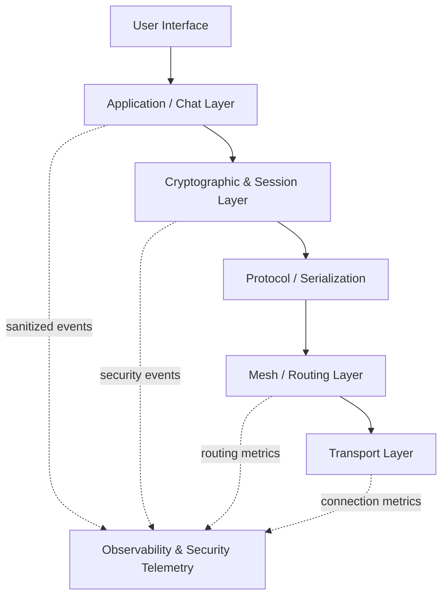
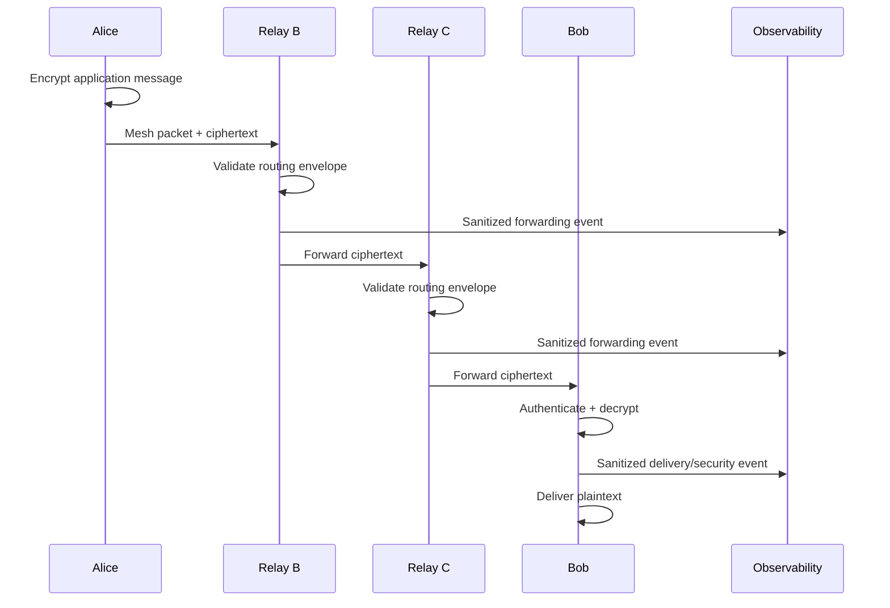
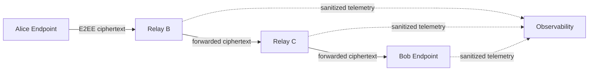
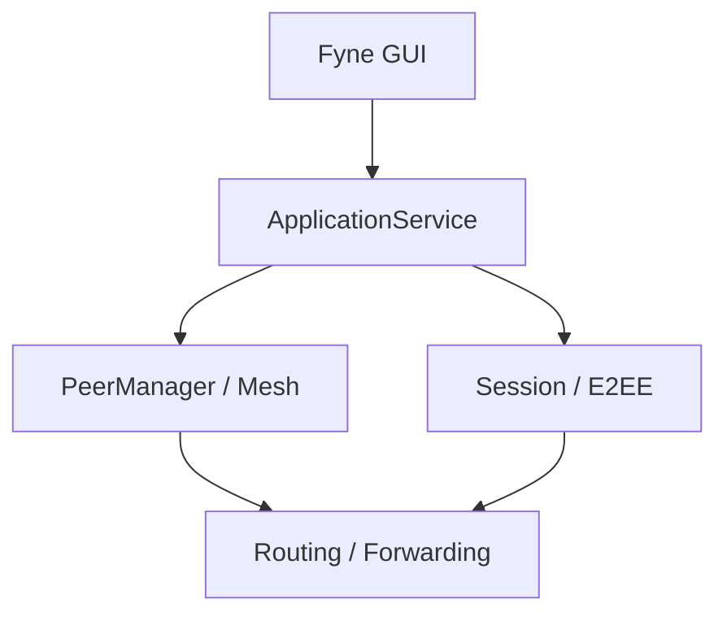

# System Architecture

## High-level architecture



Observability is an **out-of-band supporting subsystem**, not a layer in
the E2EE data path.

## Architectural principle

The project separates:

### Mesh layer

Responsible for:

- peer discovery
- connections
- routing
- forwarding
- TTL
- duplicate detection
- connection management

### Cryptographic layer

Responsible for:

- identity
- authentication
- key establishment
- key derivation
- encryption
- integrity
- replay protection

### Observability & Security Telemetry

Responsible for:

- operational metrics
- structured logs
- security events
- node-health telemetry
- performance measurements
- demonstration dashboards

It must **not** become responsible for:

- decryption
- cryptographic key storage
- message routing
- message delivery
- application plaintext processing

This separation is a fundamental security property, not merely a
software-engineering preference.

## End-to-end message path



At no point does B or C receive the E2EE plaintext. Observability must
not change that property.

## Trust boundaries



The endpoint cryptographic trust domain extends from Alice to Bob for
the application message. Relay nodes are outside that application trust
domain.

The observability platform is also outside the E2EE trust domain.

## Observability failure isolation

Grafana, Prometheus and log collection are not dependencies of message
delivery. Their failure must not prevent encryption, forwarding or
decryption.

## Architecture status

**Implemented / verified for the current milestone scope.**

See [02-Architecture-Decisions](02-Architecture-Decisions.md) and
[07-Observability-and-Security-Telemetry](07-Observability-and-Security-Telemetry.md).

## M2 Implemented Boundary

The cryptographic/session layer now contains the implemented long-term Ed25519
identity foundation. Identity generation, signing, verification, and key
ownership remain encapsulated within `internal/crypto`.

The X25519 session layer is intentionally not implemented yet. This preserves
the architectural separation between long-term identity authentication and
ephemeral session key agreement.

## M6 Mesh Layer

M6 adds a routing layer above the M5 peer runtime. The resulting hierarchy is:

```text
Application
  ↓
Endpoint E2EE Session Manager
  ↓
Mesh Router / Bounded Flooding
  ↓
Per-Peer Bounded TX Queues
  ↓
M5 Peer Manager / Direct Channels
  ↓
M4 Framed TCP Transport
```

The endpoint E2EE session is independent of the direct transport path. Intermediate relays forward ciphertext-bearing packets without possessing the endpoint session keys.

M6 is implemented and verified. It does not introduce DHT, route discovery, anonymity, or guaranteed delivery.


## M7 Security-Hardening Boundary

M7 hardens the M6 runtime without changing the established architectural
layering. Security validation is enforced before routing/cache processing,
replay-state transitions are concurrency-safe, and handshake/resource cleanup
is bounded.

Telemetry remains an out-of-band supporting subsystem. At the M7 gate the
runtime exposes telemetry hooks and a no-op implementation; an active
Prometheus exporter is not part of the current implementation. Arbitrary peer
identities are not propagated through the telemetry interface.

M7 is complete and approved. M8 may introduce concrete observability and UI
work only through its own milestone gates.


## M8 Application and GUI Layer

M8 adds an application-facing layer above the approved mesh/security backend. The Fyne GUI is intentionally a thin client of `internal/app`; it does not directly access cryptography, session management, mesh transport or routing.



Endpoint plaintext processing remains outside routing. APP_DATA reaches `internal/app` as opaque ciphertext and is decrypted only after the correct authenticated session is resolved.


## M8.3 transport admission

Normal inbound transport admission does not require out-of-band peer
pre-authorization. Inbound connections enter the bounded handshake path and
must complete the authenticated M3 exchange before peer registration. Expected
PeerID verification remains an application-level check for manual dialing.
