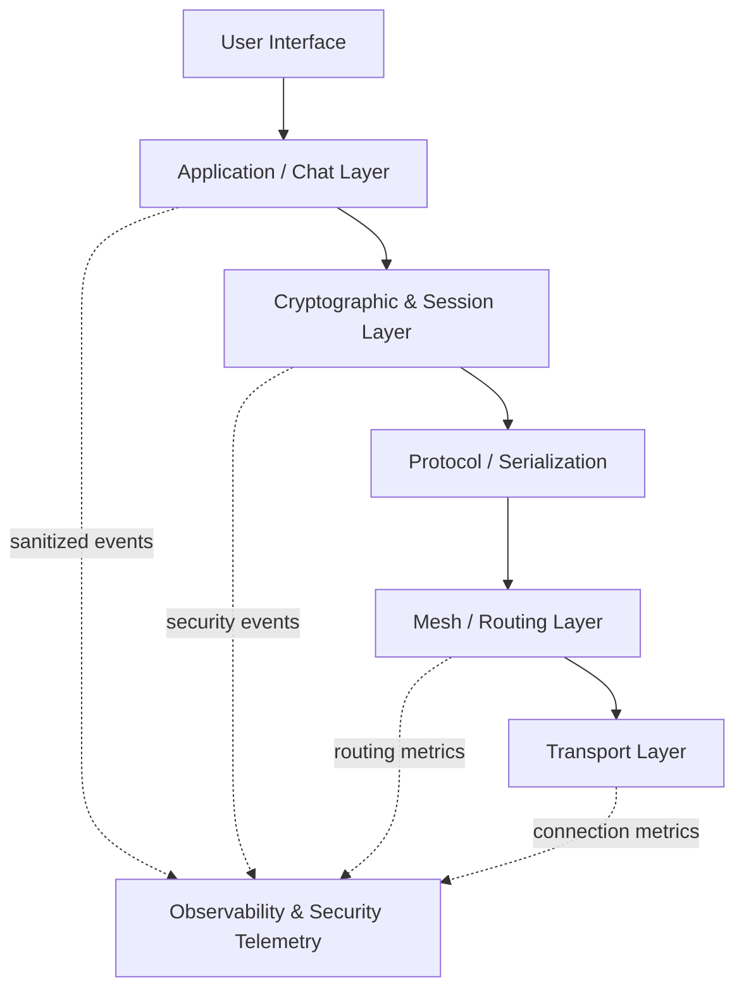
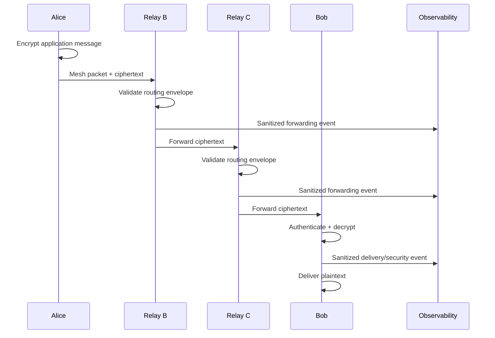
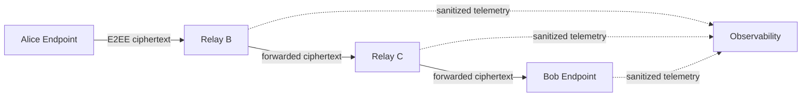

# System Architecture

## High-level architecture

Observability is an **out-of-band supporting subsystem**, not a layer in
the E2EE data path.

## Architectural principle

The project separates:

### Mesh layer

Responsible for:

- peer discovery
- connections
- routing
- forwarding
- TTL
- duplicate detection
- connection management

### Cryptographic layer

Responsible for:

- identity
- authentication
- key establishment
- key derivation
- encryption
- integrity
- replay protection

### Observability & Security Telemetry

Responsible for:

- operational metrics
- structured logs
- security events
- node-health telemetry
- performance measurements
- demonstration dashboards

It must **not** become responsible for:

- decryption
- cryptographic key storage
- message routing
- message delivery
- application plaintext processing

This separation is a fundamental security property, not merely a
software-engineering preference.

## End-to-end message path

At no point does B or C receive the E2EE plaintext. Observability must
not change that property.

## Trust boundaries

The endpoint cryptographic trust domain extends from Alice to Bob for
the application message. Relay nodes are outside that application trust
domain.

The observability platform is also outside the E2EE trust domain.

## Observability failure isolation

Grafana, Prometheus and log collection are not dependencies of message
delivery. Their failure must not prevent encryption, forwarding or
decryption.

## Architecture status

**Proposed --- not yet approved for implementation.**

See [[02-architecture/02-Architecture-Decisions]] and
[[02-architecture/07-Observability-and-Security-Telemetry]].

## M2 Implemented Boundary

The cryptographic/session layer now contains the implemented long-term Ed25519
identity foundation. Identity generation, signing, verification, and key
ownership remain encapsulated within `internal/crypto`.

The X25519 session layer is intentionally not implemented yet. This preserves
the architectural separation between long-term identity authentication and
ephemeral session key agreement.
