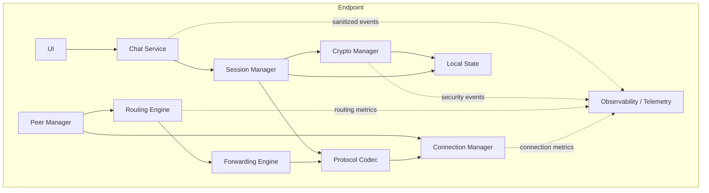

# Component Architecture

## Components

## Component responsibilities

### UI

Displays:

-   peers
-   connection state
-   conversations
-   messages
-   limited network state

Must never display private keys or session keys.

### Chat Service

Owns application-level message creation and delivery.

### Session Manager

Owns session lifecycle and cryptographic session state.

### Crypto Manager

Wraps mature cryptographic primitives.

### Protocol Codec

Serializes/deserializes protocol objects and validates structural
constraints.

### Peer Manager

Tracks known peers and connection relationships.

### Routing Engine

Determines next-hop forwarding decisions.

### Forwarding Engine

Forwards packets without decrypting application content.

### Connection Manager

Manages transport connections, timeouts and reconnection. The M4 direct
transport implementation provides bounded TCP framing and synchronized writes.

### Direct Channel

Binds one direct TCP `Connection` to one M3 `crypto.Session` for the M4 scope.
It orchestrates INIT/RESP handshake exchange, validates endpoint identity
bindings, constructs APP_DATA packets, and exposes authenticated plaintext to
the application only after successful decryption..

### Local State

Stores persistent identity and other state subject to explicit storage
policy.

## Anti-coupling rule

No component should bypass the layer below it merely because doing so is
convenient.

## Observability / Telemetry

Collects sanitized operational metrics, structured logs and
security-relevant events.

It must not:

- access private keys
- access session keys
- decrypt application messages
- alter routing decisions
- become a dependency of message delivery

Telemetry interfaces should be bounded and non-blocking where practical.

See [[02-architecture/07-Observability-and-Security-Telemetry]].

## M4 Component Status

M4 adds the implemented `internal/transport` boundary. `Connection` owns raw
TCP framing and bounded Protobuf packet transport; `ValidatePacket` enforces
protocol-level structural constraints; and `DirectChannel` integrates the
approved M3 session layer with direct secure messaging. Transport does not
implement cryptographic primitives or depend on mesh routing internals.

The M4 channel intentionally supports one established session per direct TCP
connection.

## M2 Component Status

`internal/crypto` now contains the first implemented cryptographic component:
the Ed25519 `NodeIdentity` abstraction.

The component exposes identity generation, public-key retrieval, signing, and
signature verification while keeping private key material encapsulated. No
session-key or handshake API has been introduced.

This component is the dependency boundary that the future M3
session-establishment implementation will consume.

## M5 Component Status

M5 adds the implemented `internal/mesh` runtime layer above the M4 transport
boundary. `PeerManager` owns the authenticated peer registry and coordinates
inbound listeners, outbound dialing, peer lifecycle, connection limits,
timeouts, deterministic duplicate arbitration and shutdown. Each `Peer` owns
one M4 `DirectChannel` for a direct authenticated connection.

M5 duplicate arbitration compares the canonical 32-byte Ed25519 identities.
The connection initiated by the lexicographically smaller identity is retained.
Registry replacement occurs under the manager mutex; incumbent closure occurs
after unlocking.

M5 telemetry is bounded and out-of-band. Its worker is intentionally not part
of the PeerManager `WaitGroup`, so external telemetry blocking cannot stall
manager shutdown.

M5 remains strictly a direct-networking layer. Routing, forwarding, TTL, route
discovery and network-wide duplicate suppression remain M6 responsibilities.
