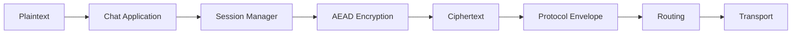
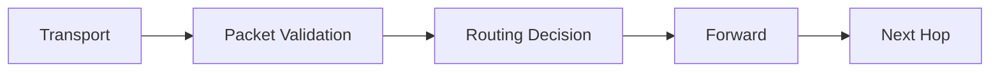
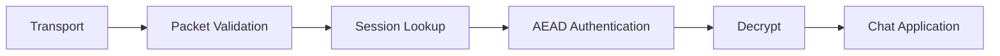
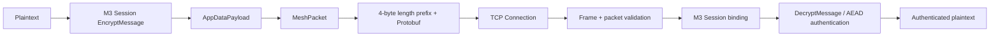

# Data Flow

## Outbound message



## Relay processing



A relay must not have an application-level path from the received packet
to a plaintext decryption operation.

## Destination processing



## Sensitive-data rule

Sensitive material must have a documented lifetime.

Examples:

-   private identity key: persistent secret
-   session key: bounded session lifetime
-   plaintext message: application-controlled lifetime
-   nonce: protocol field; never treated as secret
-   ciphertext: transport-visible but confidential

See [[05-cryptography/06-Key-Lifecycle]].


## M4 direct secure messaging flow



For M4 the path is direct and no forwarding occurs. The transport can observe
outer packet metadata and ciphertext, but not application plaintext or session
keys.

### M4 handshake flow

```text
Initiator: GenerateInit -> send INIT -> receive RESP -> ProcessResp -> Session
Responder: receive INIT -> ProcessInit -> GenerateResp -> send RESP -> Session
```

APP_DATA is rejected until the session is established.

## M6 Multi-Hop Data Flow

```text
A encrypts APP_DATA for C
        ↓
A creates MeshPacket
        ↓
B validates envelope + PacketID + TTL
        ↓
B decrements TTL and queues packet
        ↓
C receives the same endpoint ciphertext
        ↓
C authenticates/decrypts with the A-C E2EE session
```

For handshake traffic, INIT and RESP are similarly forwarded through relays, while the endpoint transcript and X25519-derived session remain between the actual initiator and responder.


## M8 Message Flow

### Outbound

```text
Fyne GUI
  ↓ SendMessage(peerID, plaintext)
ApplicationService
  ↓ session lookup
Session / AEAD
  ↓ ciphertext
Mesh routing
  ↓
Relay peers
  ↓
Destination session
```

### Inbound

```text
Relay / transport
  ↓ opaque APP_DATA
Routing
  ↓ session_id + sequence + ciphertext
ApplicationService
  ↓ Lookup(session_id)
Session.DecryptMessage()
  ↓ plaintext
SubscribeEvents()
  ↓
Fyne GUI
```

Routing does not decrypt application payloads.
