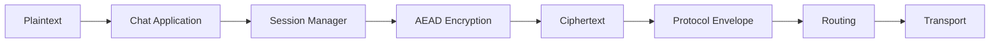
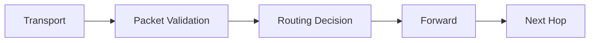
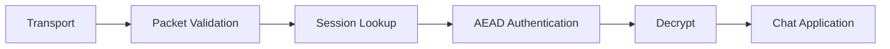

# Data Flow

## Outbound message

## Relay processing

A relay must not have an application-level path from the received packet
to a plaintext decryption operation.

## Destination processing

## Sensitive-data rule

Sensitive material must have a documented lifetime.

Examples:

-   private identity key: persistent secret
-   session key: bounded session lifetime
-   plaintext message: application-controlled lifetime
-   nonce: protocol field; never treated as secret
-   ciphertext: transport-visible but confidential

See [[05-cryptography/06-Key-Lifecycle]].
