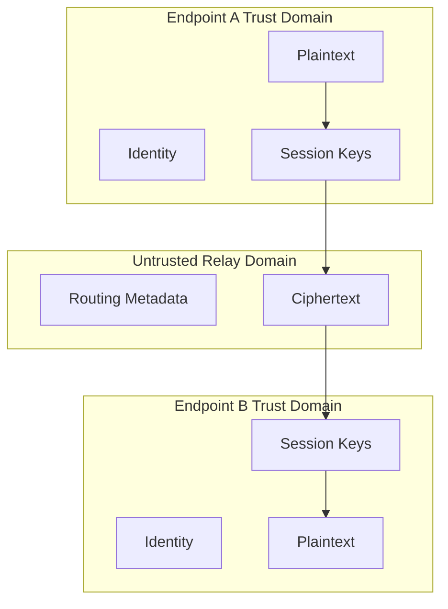

# Trust Boundaries

## Boundary 1 --- Endpoint vs relay

Alice and Bob are endpoints for the application message.

Relays are not trusted with application plaintext.

## Boundary 2 --- Application vs protocol

Application content enters the cryptographic layer before being placed
into a routable packet.

## Boundary 3 --- Protocol vs transport

Transport can deliver bytes but must not interpret application
cryptographic meaning.

## Boundary 4 --- Local storage vs runtime

Persistent private identity material is more sensitive than ordinary
configuration.

## Boundary diagram

## Review rule

Every new component must state:

1.  what it trusts
2.  what trusts it
3.  what secrets it can access
4.  what attacker-controlled input it accepts
