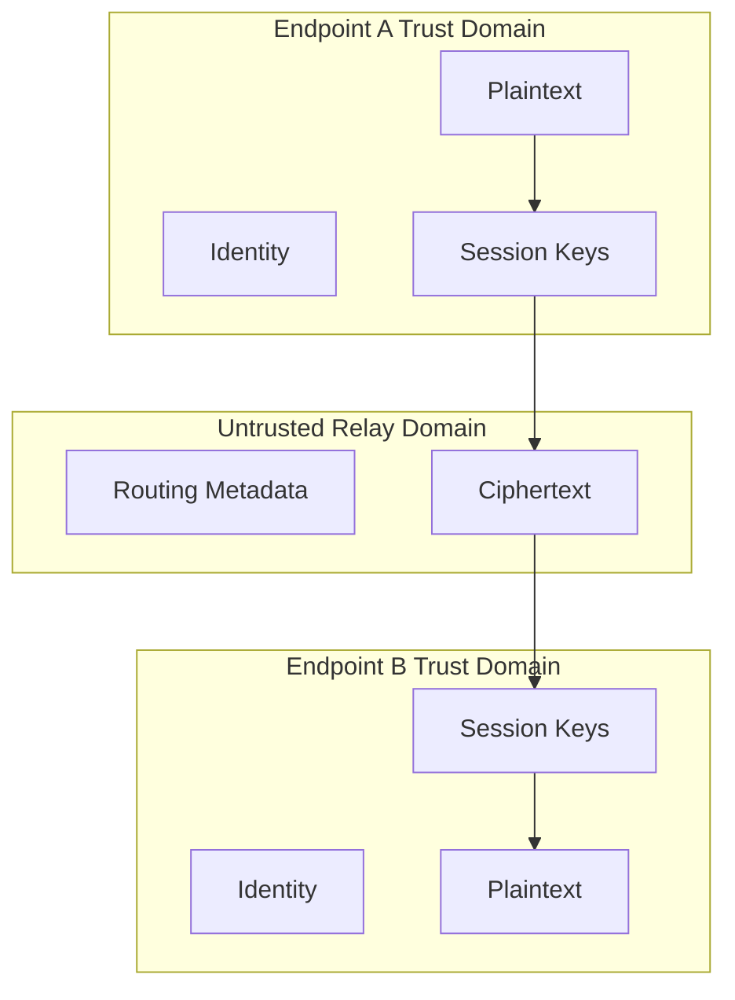

# Trust Boundaries

## Boundary 1 --- Endpoint vs relay

Alice and Bob are endpoints for the application message.

Relays are not trusted with application plaintext.

## Boundary 2 --- Application vs protocol

Application content enters the cryptographic layer before being placed
into a routable packet.

## Boundary 3 --- Protocol vs transport

Transport can deliver bytes but must not interpret application
cryptographic meaning.

## Boundary 4 --- Local storage vs runtime

Persistent private identity material is more sensitive than ordinary
configuration.

## Boundary diagram

## Review rule

Every new component must state:

1.  what it trusts
2.  what trusts it
3.  what secrets it can access
4.  what attacker-controlled input it accepts

## M4 direct transport boundary

The TCP connection is an attacker-controlled byte boundary. M4 therefore
performs bounded framing and structural packet validation before session-layer
processing. The transport does not receive plaintext or session secrets.

`DirectChannel` is the integration boundary between the application-facing
message API and the protocol/crypto layers. It must not expose plaintext from
a failed authentication or decryption attempt.

## M6 Relay Trust Boundary

The relay trust boundary is intentionally weak: a relay is trusted to forward packets according to protocol rules, but it is **not** trusted with application confidentiality.

The relay may observe routing metadata, packet type, PacketID, TTL and ciphertext. It must not obtain endpoint session keys or plaintext. A malicious relay can drop, delay, reorder, duplicate or selectively forward packets; M6 does not claim to prevent those availability attacks.

## M8 GUI Boundary

The GUI is untrusted with respect to cryptographic implementation details and is therefore restricted to the ApplicationService boundary. It may receive authenticated public identities, sanitized status/security events and endpoint plaintext for presentation.

It must not receive or manipulate private keys, session keys, ephemeral private keys, AEAD nonces, sequence state, raw protobuf packets or socket objects.

The routing layer remains a separate trust boundary: relay nodes can see routing metadata and ciphertext but do not receive endpoint session keys or application plaintext.
