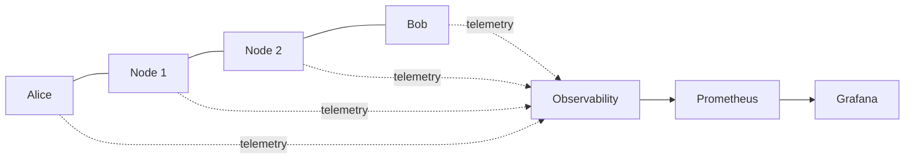

# Deployment Architecture

## Reference demonstration

## Recommended academic test topology

Four independently identifiable node processes:

- Alice endpoint
- Node 1 relay
- Node 2 relay
- Bob endpoint

They should be reproducible as containers for the standard development
and demonstration environment.

The project should not require manual host installation of application
dependencies.

## Containerized observability

The demonstration environment may additionally contain:

- Prometheus
- Grafana
- Loki or another documented structured-log backend

The exact log backend is an implementation decision.

Observability services must remain outside the E2EE message path.

## Observation points

At Node 1 and Node 2, the demonstration may show:

- packet received
- source/destination routing identifiers where permitted
- TTL
- packet identifier
- ciphertext presence
- forwarding decision
- security-safe counters/events

It must **not** reveal:

- plaintext
- private keys
- session keys
- passwords
- decrypted application content

## Observability failure

If Grafana, Prometheus or log aggregation is stopped, the mesh must
continue to provide its core communication behavior.

## Failure scenario

At minimum, one relay should be disabled during a demonstration to show
the behavior of the routing layer.

Whether automatic alternate routing is supported is an implementation
decision and must not be claimed until tested.

See [[02-architecture/07-Observability-and-Security-Telemetry]] and
[[07-testing/05-Security-Demonstrations]].

## M2 Deployment Status

M2 cryptographic identity functionality remains application-local and requires
no new deployment service. No private identity keys are baked into Docker
images or Compose configuration.

The existing containerized build/test workflow remains the required validation
environment.

## M5 Containerized Runtime Status

M5 validates the direct networking runtime in a four-node Docker Compose
environment containing Alice, Bob, Carol and Dave. The nodes run the same
containerized MeshChat application with independently generated identities.

The final runtime evidence demonstrates a deliberate simultaneous Dave↔Bob
dial collision. Dave's identity (`4765bd805913e158`) is lexicographically smaller
than Bob's (`563f793f6ad353dd`), so Dave's outbound connection is retained and
Bob's competing outbound connection is rejected by duplicate arbitration. Both
nodes report one active peer.

This topology is a runtime hardening demonstration, not evidence of M6 multi-hop
routing. No relay forwarding is claimed by M5.

## M8 GUI Deployment

The GUI is isolated from the headless backend container requirements. Fyne requires native graphical/CGO dependencies on the host/runtime environment; these are not added to the backend Dockerfile.

The M8.3 GUI was built with native dependencies and passed live two-node runtime acceptance. Docker regression remains unverified because dependency resolution in the constrained environment was blocked by external DNS/proxy restrictions.
