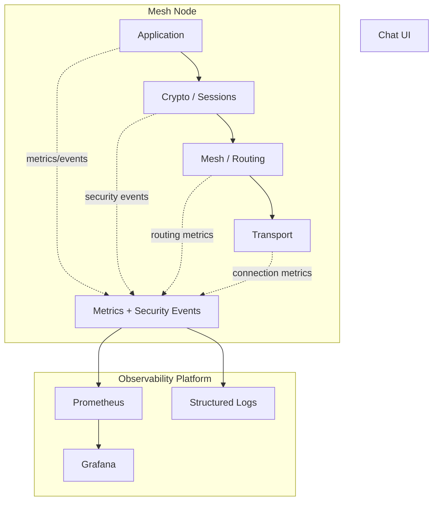
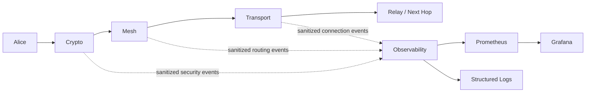
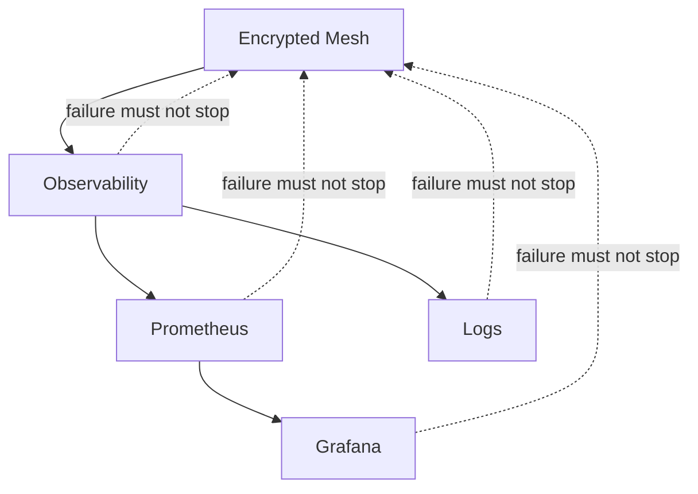

# Observability & Security Telemetry

## Status

**Proposed supporting subsystem**

Observability is an out-of-band supporting subsystem. It is not part of
the E2EE message-routing or cryptographic trust path.

## Purpose

The observability subsystem provides enough operational, performance and
security telemetry to:

- understand node health
- inspect mesh behavior
- diagnose failures
- demonstrate security controls
- measure protocol/network performance
- support reproducible academic evaluation

The subsystem must remain optional to core message delivery.

If Grafana, Prometheus or log collection is unavailable, the encrypted
mesh must continue to operate.

## Architecture



## Observability boundary



Observability is deliberately shown as a side channel.

### Critical invariant

> **Telemetry must never be required to decrypt, authenticate, route,
> forward or deliver an application message.**

## Telemetry categories

### Metrics

Metrics answer:

> "How is the system behaving?"

Examples:

#### Network

```text
mesh_peers_connected
mesh_packets_received_total
mesh_packets_forwarded_total
mesh_packets_dropped_total
mesh_packets_expired_total
mesh_route_changes_total
mesh_route_failures_total
```

#### Security

```text
crypto_handshakes_total
crypto_handshake_failures_total
crypto_authentication_failures_total
crypto_decryption_failures_total
crypto_replay_rejections_total
crypto_invalid_signature_total
```

#### Performance

```text
message_latency_seconds
message_size_bytes
active_sessions
active_connections
routing_table_size
```

#### Node health

```text
process_uptime
memory_usage
cpu_usage
event_loop_latency
```

Metric names and labels are provisional and must be finalized before
implementation.

## Structured logs

Logs answer:

> "What happened?"

Example:

```json
{
  "event": "PACKET_FORWARDED",
  "node_id": "node-a",
  "packet_id": "7f3...",
  "next_hop": "node-b",
  "ttl": 4
}
```

Structured logs should use stable event names and machine-readable
fields so Grafana/Loki or another compatible backend can consume them.

## Security events

Security events answer:

> "Did something suspicious or security-relevant happen?"

Examples:

```text
AUTHENTICATION_FAILED
SIGNATURE_VERIFICATION_FAILED
DECRYPTION_FAILED
REPLAY_REJECTED
MALFORMED_PACKET
RATE_LIMIT_TRIGGERED
SESSION_ESTABLISHED
SESSION_ROTATED
```

A security event is distinct from a generic operational metric or log.

## Telemetry privacy policy

### Never export

```text
plaintext application messages
private keys
session keys
passwords
raw decrypted messages
secret cryptographic material
```

Raw ciphertext should not be exported unless there is a documented
debugging requirement and the security implications are explicitly
accepted.

### Potentially sensitive metadata

The following may leak information and require deliberate minimization:

- node identities
- source/destination identifiers
- IP addresses
- timestamps
- packet sizes
- packet identifiers
- route information
- peer relationships

Telemetry should expose only the minimum metadata needed for the stated
operational or demonstration purpose.

## Relay confidentiality requirement

Relay nodes may observe routing metadata required for forwarding, but
observability must not create a new path to application plaintext.

In particular:

- relay logs must not contain decrypted application messages
- relay metrics must not count or expose plaintext content
- cryptographic failures must not dump secret material
- debug logging must not bypass the normal E2EE boundary

## Failure isolation

Failure of any observability component must not break the core system.



The implementation should prefer non-blocking or bounded telemetry paths
so logging pressure cannot become an uncontrolled denial-of-service
against message processing.

## Containerization

The observability stack must be containerized alongside the project.

A demonstration deployment may contain:

- mesh node containers
- Prometheus container
- Grafana container
- structured log collection/storage component

The exact log backend remains an implementation decision. Loki is the
preferred candidate for the initial design, but the application should
not depend directly on Grafana-specific APIs.

## Security controls

- no secrets in telemetry
- bounded log/event sizes
- structured event schema
- sanitized error messages
- controlled telemetry labels
- no plaintext logging
- no observability dependency in the E2EE path
- telemetry components isolated from cryptographic state
- containerized and reproducible deployment

## Testing requirements

Observability must itself be tested.

At minimum:

1. Verify a normal forwarded packet increments the appropriate metrics.
2. Verify replay rejection creates the expected security event/counter.
3. Verify tampering causes a security event without exposing plaintext.
4. Verify malformed packets cannot inject arbitrary log structure.
5. Verify user message content does not appear in relay logs.
6. Verify private/session keys never appear in logs.
7. Verify telemetry failure does not prevent message delivery.
8. Verify excessive telemetry cannot grow state without bounds.

## Demo value

Observability supports, but does not replace, security demonstrations.

For example:

```text
Valid packet
    ↓
Replay attempted
    ↓
Receiver rejects packet
    ↓
crypto_replay_rejections_total +1
    ↓
Grafana dashboard / security event
```

The authoritative security result remains the protocol behavior and test
evidence, not the dashboard visualization.

## Technology decision

### Initial candidate

**Prometheus + Grafana + structured logs**, with Loki as the preferred
log aggregation backend if the added deployment complexity remains
reasonable.

### Explicit non-goal

Do not add a large observability ecosystem merely for visual
complexity. Elasticsearch/Logstash/Kibana, Jaeger, OpenTelemetry and
other systems should only be introduced if a concrete project
requirement justifies them.

See [[02-architecture/02-Architecture-Decisions]] and
[[07-testing/06-Test-Evidence-Standard]].

## M2 Telemetry Boundary

The Ed25519 identity implementation introduces no requirement for telemetry.
Private keys, signatures, and message contents must remain outside logs and
metrics.

Future security telemetry may report bounded security events such as
authentication/signature failures, but must never export cryptographic secret
material.


## M5 Telemetry Implementation Boundary

M5 introduces the first bounded runtime telemetry execution path. Peer-manager
events are submitted through a non-blocking bounded queue. Queue overflow drops
telemetry events rather than blocking networking.

The telemetry worker is intentionally outside the PeerManager `WaitGroup`.
Consequently, a blocking external recorder cannot prevent manager shutdown.
Recorder failures are recovered at the telemetry boundary. The telemetry queue
is not closed during manager shutdown, avoiding send-on-closed-channel races; the
worker lifecycle is controlled independently through its quit signal.

M5 telemetry remains out-of-band and must never contain application plaintext,
private keys, session keys, passwords or other secret cryptographic material.
