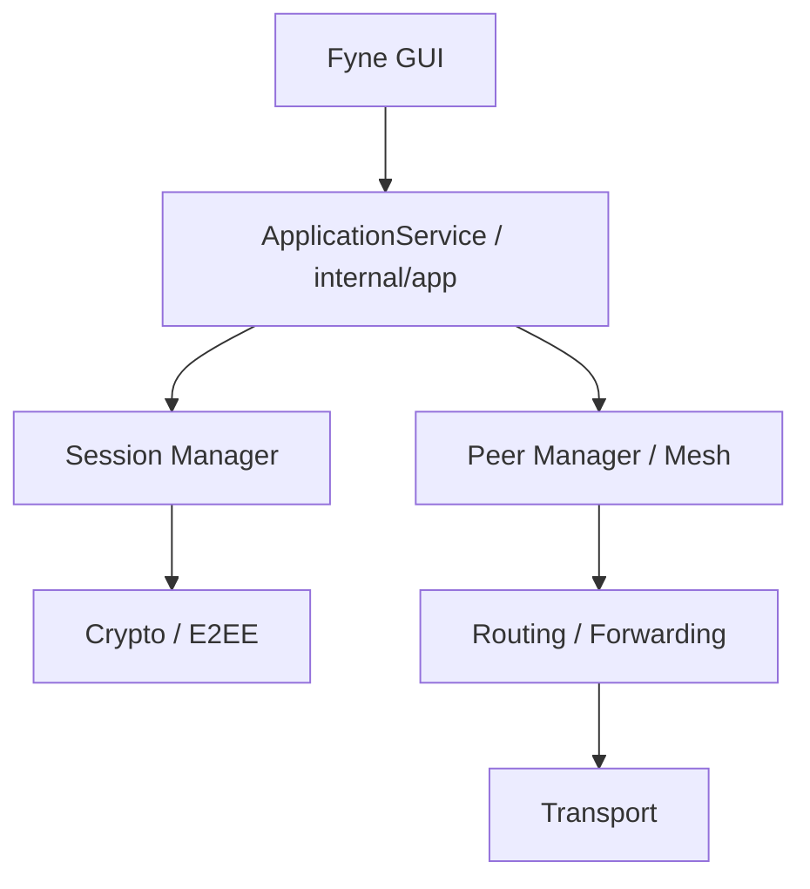
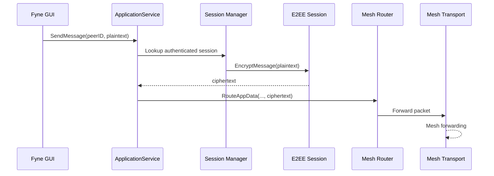
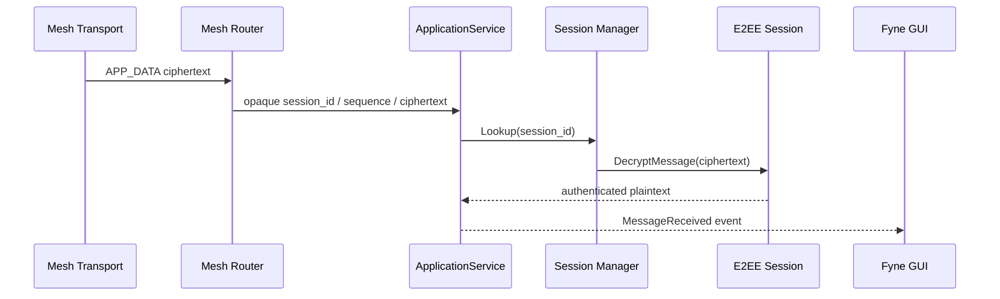
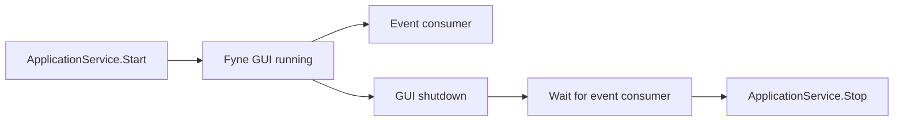
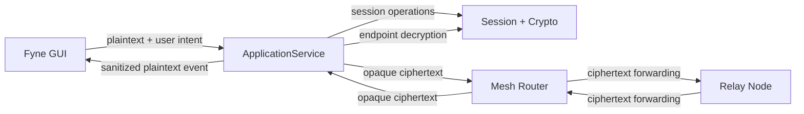

# Application Service Boundary

## Status

**Approved — M8.3 Functional GUI Integration**

`internal/app` is the application-facing boundary between the Fyne GUI and
all lower-level messaging, session, mesh, routing and cryptographic
components.

The boundary exists to keep presentation concerns separate from security and
networking internals.

## Architectural Position



The GUI communicates with the application layer rather than directly with
cryptographic, session, routing or transport components.

## ApplicationService Responsibilities

The application layer owns presentation-facing operations such as:

- exposing the local public PeerID
- initiating manual peer connections
- starting conversations with authenticated peers
- listing conversations
- accepting plaintext for outbound application messages
- resolving endpoint sessions
- decrypting inbound application messages at the endpoint
- publishing sanitized application events
- starting and stopping application services

The application layer does **not** redefine the underlying cryptographic or
mesh protocols.

## Primary Interface

The application-facing API established for M8 is conceptually:

```go
type ApplicationService interface {
    GetLocalIdentity() string
    DialNode(ctx context.Context, address string, expectedPeerID string) error
    StartConversation(peerID string) error
    ListConversations() []string
    SendMessage(peerID string, plaintext string) error
    Start() error
    Stop() error
    SubscribeEvents() <-chan AppEvent
}
```

Implementations may add narrowly scoped application-layer operations when
required by the approved GUI workflow, but lower-level crypto/session/routing
objects must not be exposed through the GUI boundary.

## Identity Boundary

The GUI may display and copy the local **public** Ed25519 identity.

The GUI must never receive:

```text
Ed25519 private keys
X25519 private keys
Ephemeral private keys
Session keys
AEAD keys
AEAD nonces
Raw cryptographic state
```

The normal UI representation is a shortened PeerID. Copying the identity
uses the full public PeerID supplied by the application layer.

A PeerID is a cryptographic identity and must not be confused with a TCP
network address.

## Peer and Conversation Boundary

The application layer distinguishes:

```text
PeerID       = authenticated cryptographic identity
NetworkAddress = transport location used for dialing
Conversation = application relationship identified by authenticated PeerID
```

Manual dialing may accept a network address and an expected PeerID, but a TCP
address alone does not establish application identity.

Conversation state is maintained in memory for the M8 scope.

No persistent plaintext message database was introduced.

## Outbound Message Flow



The GUI supplies plaintext to the application API. It does not perform
AEAD encryption, generate nonces, manage sequence numbers or construct raw
protocol packets.

## Inbound Message Flow



### Critical security invariant

> **`internal/routing` must remain completely blind to application plaintext.**

The router validates and forwards application packets but does not call
`DecryptMessage()`.

Endpoint decryption occurs in `internal/app` after the appropriate
authenticated session has been resolved.

This boundary was explicitly audited during M8.1 and M8.3.

## Application Events

The GUI consumes sanitized events through `SubscribeEvents()`.

Relevant event categories include:

```text
Session established
Session failure
Connection failure
Message received
```

Security-sensitive internal objects are not exposed through these events.

In particular, a session-established event communicates that an authenticated
session is ready; it does not expose session keys or handshake internals.

## Connection and Security Status

The GUI must distinguish transport state from cryptographic state.

```text
Connecting
    ↓
Connected
    ↓
Handshaking
    ↓
Secure Session Established
```

A TCP connection being established does not by itself mean that a secure
application session has been authenticated.

The GUI displays **Secure Session Established** only after the application
layer receives confirmation that the authenticated session has been
successfully established.

## GUI Isolation Rules

The GUI must not directly import or manipulate:

```text
internal/crypto
internal/session
internal/mesh
internal/routing
```

The GUI must not perform:

- encryption or decryption
- X25519 operations
- handshake signing
- session-key derivation
- nonce generation
- AEAD sequence management
- raw socket operations
- packet construction
- routing decisions

These operations remain owned by the backend layers.

## GUI State

M8 maintains synchronized in-memory GUI state for:

- peer list
- current conversation
- conversation history
- sender identity
- plaintext message content
- message timestamps
- connection/security status

The GUI state is protected against concurrent access between Fyne callbacks
and backend event delivery.

Message history is presentation/application state and is not treated as a
cryptographic store.

## Lifecycle Boundary

Application lifecycle is explicitly coordinated:



The GUI event-consumer goroutine is signaled to stop and the shutdown path
waits for that consumer to terminate before `ApplicationService.Stop()` is
called.

This prevents backend teardown from racing with an active GUI event
consumer.

## Trust Boundary



The relay remains outside the endpoint trust relationship for application
plaintext. Possession of a routing position does not grant access to the
endpoint session keys.

## Security Properties Preserved by the Boundary

The application boundary supports the following established properties:

- confidentiality of application plaintext against mesh relays
- authenticated endpoint session establishment
- integrity through ChaCha20-Poly1305 AEAD
- replay protection through the existing session layer
- separation of routing metadata from endpoint plaintext
- encapsulation of private and session cryptographic material
- controlled GUI access to application state

The boundary does not provide anonymity, complete metadata hiding or
compromise protection for a malicious endpoint; those remain outside the
project's stated security goals.

## M8 Implementation Status

M8.1 established the application layer and corrected the critical routing
boundary so that routing receives opaque ciphertext rather than plaintext.

M8.2 integrated the Fyne GUI foundation while preserving the application
boundary and synchronized GUI state.

M8.3 completed functional GUI integration, including manual peer connection,
conversation handling, message display, public identity copying, connection
and secure-session status events, and application-layer integration testing.

The M8.3 verification suite passed the backend build, vet, unit/integration
and race checks. GUI visual runtime and Docker regression remained unverified
because the available test environment lacked required native graphics
support and had external proxy/DNS restrictions.

## Related Documentation

- [01-System-Architecture](01-System-Architecture.md)
- [03-Component-Architecture](03-Component-Architecture.md)
- [04-Data-Flow](04-Data-Flow.md)
- [05-Trust-Boundaries](05-Trust-Boundaries.md)
- [10-M8.1-Acceptance-Evidence](../07-testing/10-M8.1-Acceptance-Evidence.md)
- [11-M8.2-Acceptance-Evidence](../07-testing/11-M8.2-Acceptance-Evidence.md)
- [12-M8.3-Acceptance-Evidence](../07-testing/12-M8.3-Acceptance-Evidence.md)
- [06-Architecture-Review-M8](../00-governance/06-Architecture-Review-M8.md)
