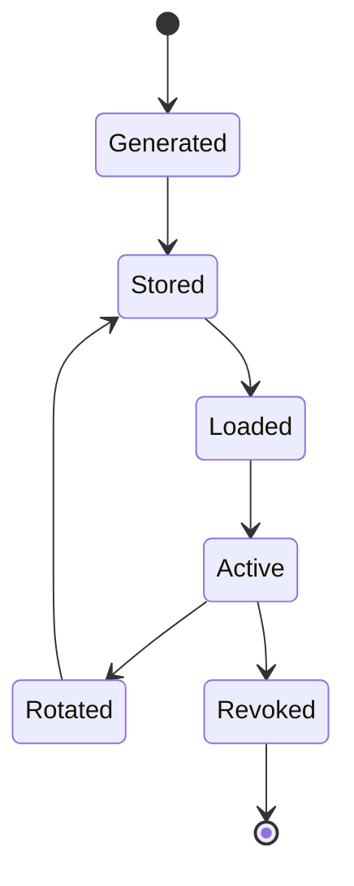

# Node Identity

## Identity model

Each node has a long-term Ed25519 keypair:

``` text
Identity
├── public key
└── private key
```

The public key is the basis of the node's cryptographic identity.

## Identity requirements

-   generation uses a mature cryptographic library
-   private key is treated as secret
-   public key can be shared
-   signatures authenticate identity-controlled data
-   modified signed data must fail verification
-   invalid signatures must be rejected

## Identity lifecycle



The exact rotation/revocation mechanism remains an implementation design
decision.

## Identity change

A peer's public identity changing must not silently be treated as the
same peer.

The application must define whether the change is:

-   rejected
-   explicitly re-enrolled
-   treated as a new identity

See [[05-cryptography/02-Identity-and-Signatures]].
