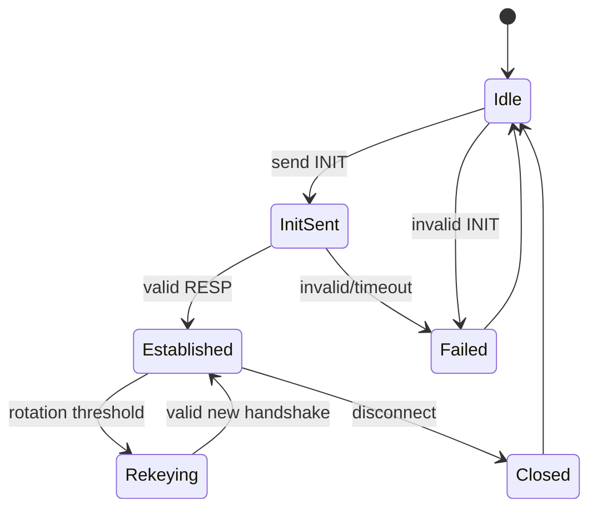

# Session Establishment

## Status

**Canonical construction frozen; M3 implementation remains gated.**

The following transcript and KDF decisions are the approved protocol
baseline for M3.1 and subsequent session-establishment work. Freezing the
construction does not mean that the implementation exists.

## Key roles

Each node has:

- long-term Ed25519 identity keypair
- fresh ephemeral X25519 keypair per session

The Ed25519 key is used for authentication/signatures only.

The X25519 key is used for key agreement only.

Long-term identity keys must never be reused as X25519 private keys.

## Canonical handshake transcript

The protocol domain is the ASCII byte string:

```text
DOMAIN = "MeshChat-Handshake-v1"
PROTOCOL_VERSION = 0x01
ZERO32 = 32 zero bytes
```

Let:

```text
ID_A = 32-byte Ed25519 public key of the initiator
ID_B = 32-byte Ed25519 public key of the responder
E_A  = 32-byte X25519 public key of the initiator
E_B  = 32-byte X25519 public key of the responder
```

The canonical initiator transcript is:

```text
T_INIT = DOMAIN ||
         u8(PROTOCOL_VERSION) ||
         ID_A ||
         ID_B ||
         E_A ||
         ZERO32
```

The canonical responder transcript is:

```text
T_RESP = DOMAIN ||
         u8(PROTOCOL_VERSION) ||
         ID_A ||
         ID_B ||
         E_A ||
         E_B
```

Alice signs `T_INIT` with her Ed25519 identity private key.

Bob verifies Alice's signature, then signs `T_RESP` with his Ed25519
identity private key.

Alice verifies Bob's signature.

The zero responder-ephemeral field in `T_INIT` makes the two signed
transcripts unambiguous while the responder signature authenticates the
complete exchange.

## Shared secret

After successful signature validation:

```text
SS = X25519(ephemeral_private, peer_ephemeral_public)
```

`SS` is 32 bytes. The implementation must reject invalid/low-order peer
public keys according to the selected X25519 API's documented behavior,
including any all-zero shared-secret condition required by that API.

M3.1 must deliberately freeze the exact Go API/library used for X25519
before implementation.

## Session identifier and KDF

The session identifier is:

```text
session_id = SHA256(T_RESP)
```

The full 32-byte digest is used; it is not truncated.

The KDF uses:

```text
salt = SHA256(T_RESP)
PRK  = HKDF-Extract(salt, SS)
```

Directional keys are derived as:

```text
K_A_to_B = HKDF-Expand(
    PRK,
    "MeshChat-v1|session|initiator->responder",
    32
)

K_B_to_A = HKDF-Expand(
    PRK,
    "MeshChat-v1|session|responder->initiator",
    32
)
```

The exact byte encoding of the HKDF `info` strings is their ASCII byte
representation. Directional separation is mandatory.

## Trust model

The Ed25519 public-key trust source is either:

- a pre-shared/managed public-key directory, or
- TOFU for first contact.

TOFU alone does **not** authenticate first contact against an active MITM.
The final implementation must make the selected trust mode explicit.

## Key lifecycle

After a successful handshake:

- retain only the session state required for operation
- erase ephemeral private keys as soon as they are no longer required
- never persist session keys by default
- establish fresh session keys after restart
- establish fresh session keys during rotation

Forward secrecy is conditional on fresh ephemeral keys, appropriate private-key
erasure, and absence of endpoint compromise. The protocol does not claim
post-compromise security.

## Handshake replay and state

Handshake messages require their own duplicate/replay handling.

A captured INIT or RESP must not silently replace a live session with
attacker-controlled state. The implementation must define acceptable
retransmission behavior and state transitions.

Session rotation is planned after **2^16 application messages or 24 hours,
whichever occurs first**, subject to M3 implementation and test evidence.

## Failure states

At minimum:



Invalid signatures, malformed messages, unexpected state transitions and
timeouts must fail closed.

## M2 Dependency Status

The long-term Ed25519 identity primitive required by the authenticated
session protocol is implemented and audited.

The session-establishment implementation itself remains unimplemented and
gated to M3.1. In particular, the X25519 API choice, ephemeral key lifecycle,
shared-secret handling, and implementation-level error/zeroization behavior
must be explicitly reviewed before code is written.
