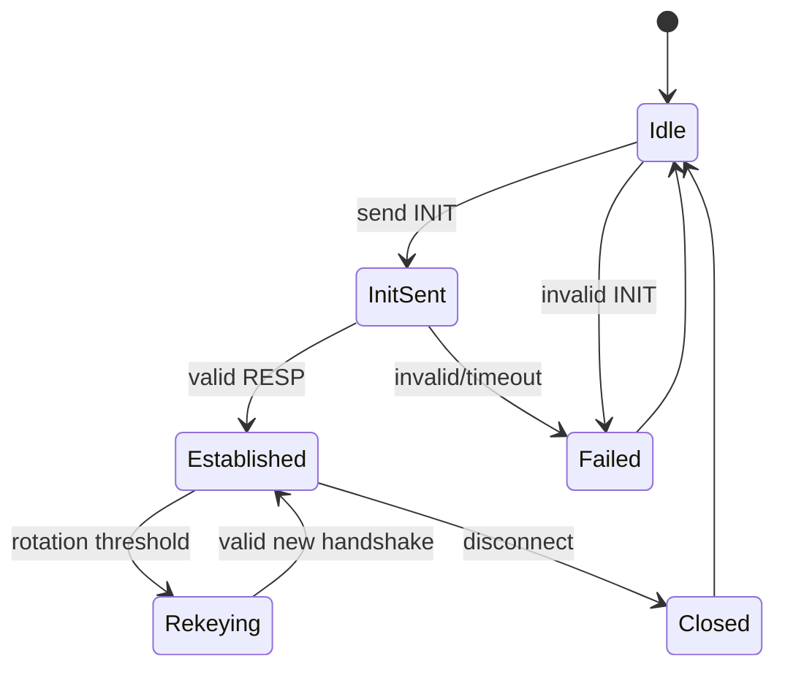

# Session Establishment

## Status

**Canonical construction implemented / verified in M3.2.**

The following transcript, signature and KDF construction is the frozen
protocol baseline and is now implemented.

## Key roles

Each node has:
- long-term Ed25519 identity keypair
- fresh ephemeral X25519 keypair per session

The Ed25519 key is used for authentication/signatures only.
The X25519 key is used for key agreement only.

Long-term identity keys must never be reused as X25519 private keys.

## Canonical handshake transcript

```text
DOMAIN = "MeshChat-Handshake-v1"
PROTOCOL_VERSION = 0x01
ZERO32 = 32 zero bytes
```

Let:
```text
ID_A = 32-byte Ed25519 public key of initiator
ID_B = 32-byte Ed25519 public key of responder
E_A  = 32-byte X25519 public key of initiator
E_B  = 32-byte X25519 public key of responder
```

The canonical initiator transcript is:

```text
T_INIT = DOMAIN || u8(PROTOCOL_VERSION) || ID_A || ID_B || E_A || ZERO32
```

The canonical responder transcript is:

```text
T_RESP = DOMAIN || u8(PROTOCOL_VERSION) || ID_A || ID_B || E_A || E_B
```

Alice signs `T_INIT`. Bob verifies Alice's signature, then signs `T_RESP`.
Alice verifies Bob's signature.

The zero responder-ephemeral field in `T_INIT` makes the two signed
transcripts unambiguous while the responder signature authenticates the
complete exchange.

## Shared secret

After successful signature validation:

```text
SS = X25519(ephemeral_private, peer_ephemeral_public)
```

The implementation uses Go's `crypto/ecdh.X25519()` and rejects malformed or
invalid/low-order peer public keys according to the API behavior.

The raw shared secret is passed to HKDF and is not used directly as an
application encryption key.

## Session identifier and KDF

```text
session_id = SHA256(T_RESP)

salt = SHA256(T_RESP)
PRK  = HKDF-Extract(salt, SS)

K_A_to_B = HKDF-Expand(
    PRK,
    "MeshChat-v1|session|initiator->responder",
    32
)

K_B_to_A = HKDF-Expand(
    PRK,
    "MeshChat-v1|session|responder->initiator",
    32
)
```

The full 32-byte transcript digest is used. HKDF `info` labels are their
ASCII byte representation.

## Session API boundary

A successful handshake produces a session containing:
- session identifier
- directional send key
- directional receive key
- local role

The session API internally derives the AEAD direction marker. Callers cannot
select a direction independently of the established role.

## Trust model

The Ed25519 public-key trust source is either:
- a pre-shared/managed public-key directory, or
- TOFU for first contact.

TOFU alone does **not** authenticate first contact against an active MITM.
The selected trust mode must remain explicit.

## Key lifecycle

After a successful handshake:
- ephemeral private keys are retired as soon as no longer required
- session keys remain memory-only
- restart invalidates old session state
- fresh handshakes establish fresh session keys
- rotation uses fresh ephemeral keys

Forward secrecy is conditional on fresh ephemeral keys, appropriate private
key erasure and uncompromised endpoints. No post-compromise security claim
is made.

## Handshake state and replay

The handshake state machine rejects invalid ordering, duplicate processing
and malformed transitions. This is distinct from application-message replay
protection, which is enforced by the M3.3 session receive window.

A fresh ephemeral key does not by itself prove that an incoming handshake is
new. Handshake retransmission/duplicate policy remains a protocol concern
separate from application ciphertext replay.

## Failure states



Invalid signatures, malformed messages, unexpected state transitions and
timeouts fail closed.

## M3 evidence

M3.2 tests cover successful handshake, transcript tampering, identity
substitution, ephemeral substitution, role confusion, state failures,
session-ID derivation, transcript sensitivity, HKDF known-answer values,
independent handshakes and malformed inputs. Containerized formatting,
vetting, tests, race detection and build validation passed.
