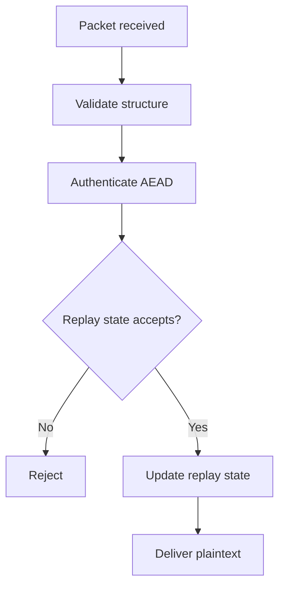

# Replay Protection

## Threat

An attacker captures an accepted ciphertext and later sends it again.

Without replay protection:

``` text
Alice → Bob: TRANSFER/COMMAND/MESSAGE
Attacker captures packet
Attacker → Bob: same packet again
```

The application may incorrectly process it twice.

## Required controls

Use a combination of:

-   unique message/packet identifiers
-   sequence numbers
-   authenticated session identifiers
-   receiver replay state
-   bounded replay windows where appropriate

Timestamps alone are insufficient.

## Conceptual receiver flow



The exact ordering between cryptographic authentication and replay-state
mutation must be designed carefully so attacker-controlled packets
cannot poison state.

## Requirements

-   duplicate packet rejected
-   old packet rejected
-   invalid packet does not advance replay state
-   replay state survives the relevant session lifetime
-   reconnect behavior is explicitly defined
