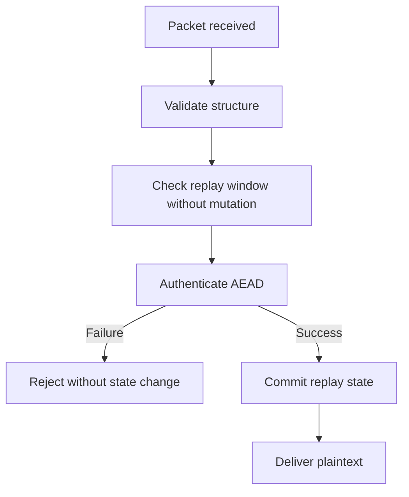

# Replay Protection

## Threat

An attacker captures an accepted ciphertext and later sends it again.

Without replay protection:

```text
Alice -> Bob: TRANSFER/COMMAND/MESSAGE
Attacker captures packet
Attacker -> Bob: same packet again
```

The application may incorrectly process it twice.

## Required controls

Use:
- unique packet identifiers at the mesh layer
- per-direction sequence numbers at the session layer
- authenticated session identifiers
- receiver replay state
- a bounded replay window

Timestamps alone are insufficient.

## Receiver flow



The M3.3 implementation uses a 64-message receive window and commits state
only after successful AEAD authentication.

## Requirements

- duplicate application ciphertext rejected
- sequence numbers outside the receive window rejected
- valid out-of-order ciphertext inside the window accepted once
- invalid ciphertext does not advance replay state
- cross-session ciphertext rejected
- cross-direction ciphertext rejected
- restart invalidates old session replay state
- mesh PacketID duplicate handling remains independent of session replay
