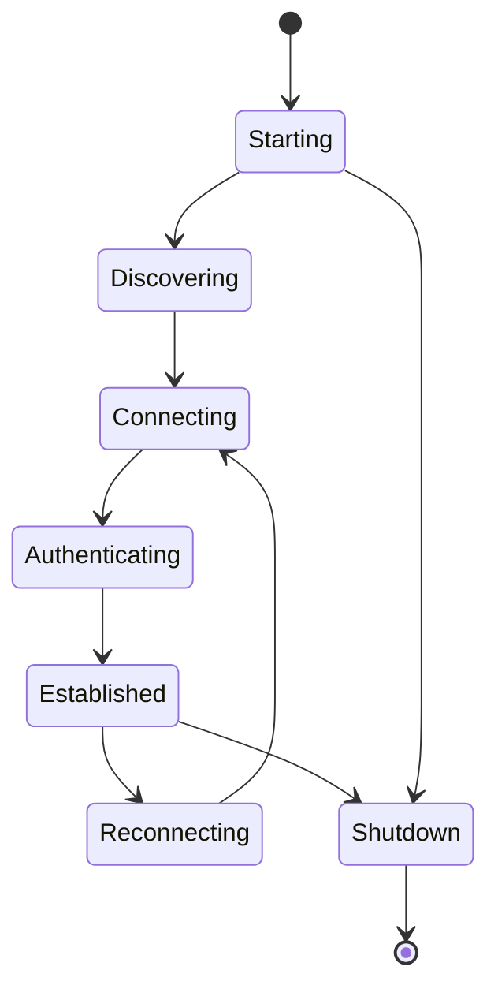
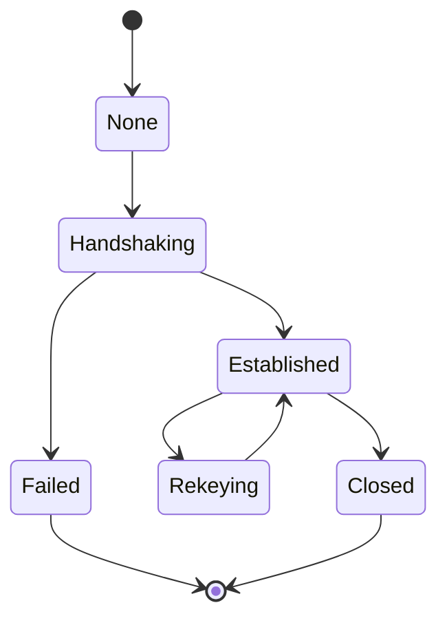

# Protocol State Machines

## Node lifecycle

## Session lifecycle

## Invalid transitions

Invalid state transitions must:

-   be rejected
-   not expose secrets
-   not corrupt state
-   produce bounded diagnostic information

## M3 session implementation boundary

The session state machine is implemented for the M3 handshake/session layer.
The implementation distinguishes:
- handshake state transitions
- established-session operation
- rekey/rotation boundary
- closed/failed states

Invalid transitions fail closed and do not expose cryptographic secrets.

The handshake state machine's duplicate/ordering checks are not a substitute
for application-message replay protection. Application replay is enforced by
the 64-message per-session receive window described in
[05-Replay-Protection](05-Replay-Protection.md).

## M6 Multi-Hop Session State

Transport peer state and endpoint E2EE session state are independent. A relay may carry INIT, RESP and APP_DATA packets without becoming an endpoint of the application session.

For an initiator, pending handshake candidates are scoped by remote identity and `SHA256(T_INIT)`. A RESP must match exactly one candidate's frozen M3 transcript before that candidate is consumed and the session registered.
