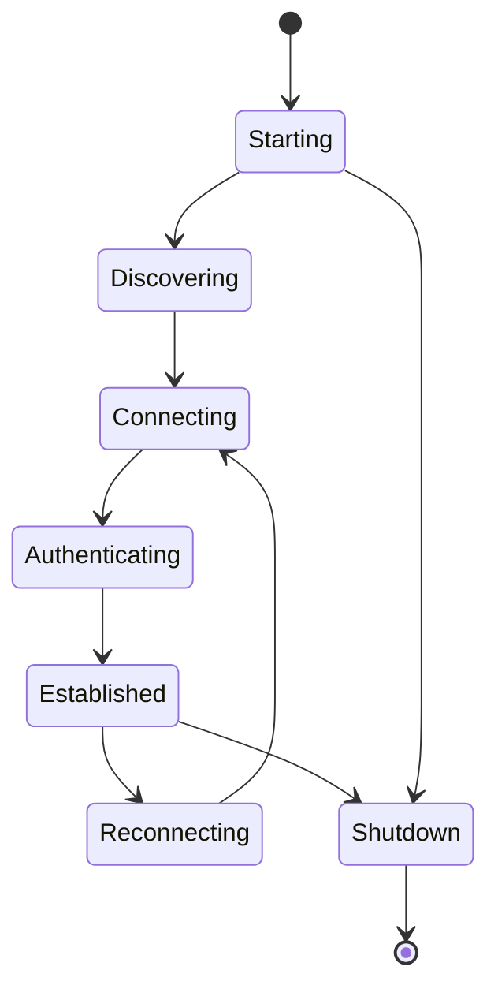
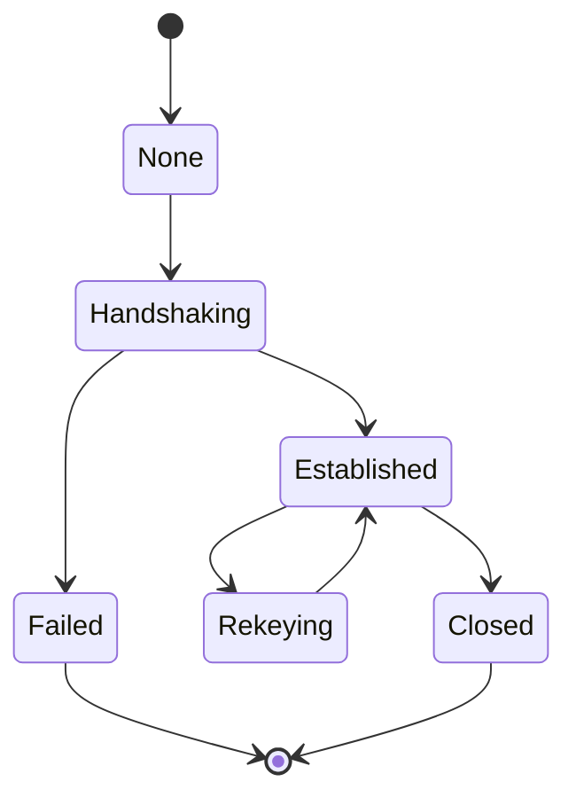

# Protocol State Machines

## Node lifecycle

## Session lifecycle

## Invalid transitions

Invalid state transitions must:

-   be rejected
-   not expose secrets
-   not corrupt state
-   produce bounded diagnostic information
