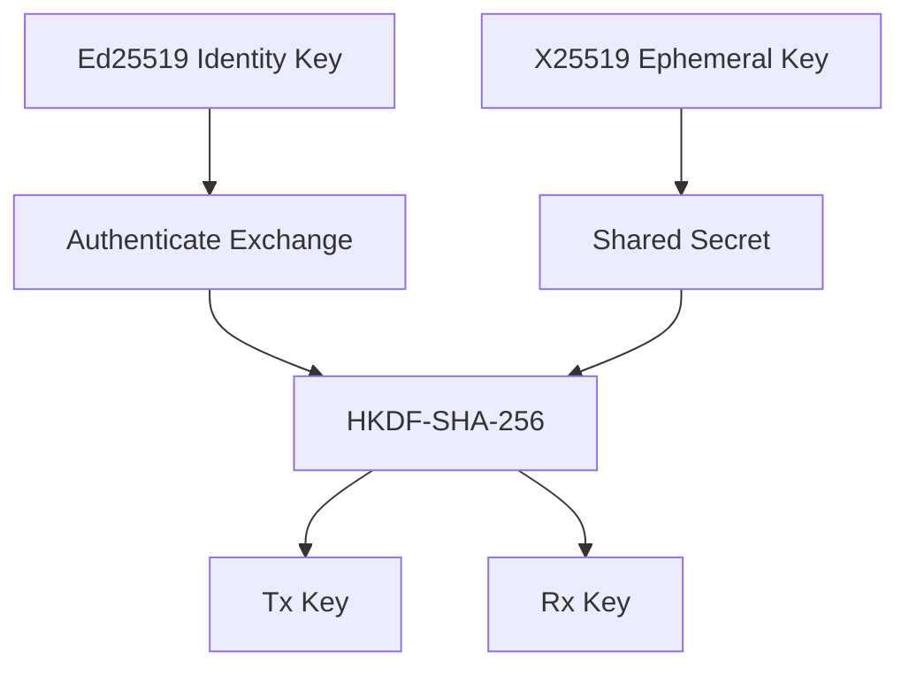

# Cryptographic Architecture

## Primitive selection

  Purpose                     Primitive           Status
  --------------------------- ------------------- -------------------
  Identity/signature          Ed25519             Implemented / verified
  Key agreement               X25519              Accepted / M3 gated
  Symmetric AEAD              ChaCha20-Poly1305   Accepted / future milestone
  KDF                         HKDF-SHA-256        Accepted / M3 gated
  Password KDF if needed      Argon2id            Conditional
  General hashing if needed   SHA-256/SHA-3       Context-dependent

## Principle

Use established implementations from mature cryptographic libraries.

Do not implement primitives from scratch.

## Key separation

## Current implementation boundary

The Ed25519 identity/signature component is implemented and audited in M2.
X25519, HKDF, and AEAD remain unimplemented. The approved protocol design
requires separate long-term Ed25519 identity keys and fresh ephemeral
X25519 keys; identity keys must never be reused as X25519 private keys.

The canonical handshake transcript and session KDF are frozen in the
protocol documentation, but implementation remains gated to M3.

See [[04-protocol/03-Session-Establishment]] and
[[05-cryptography/07-Cryptographic-Failure-Modes]].
