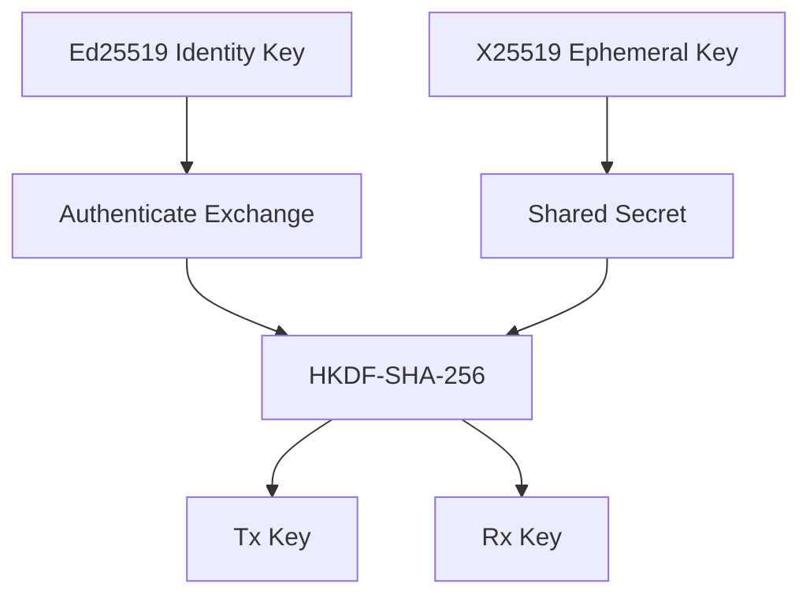

# Cryptographic Architecture

## Primitive selection

  Purpose                     Primitive           Status
  --------------------------- ------------------- -------------------
  Identity/signature          Ed25519             Proposed
  Key agreement               X25519              Proposed
  Symmetric AEAD              ChaCha20-Poly1305   Proposed
  KDF                         HKDF-SHA-256        Proposed
  Password KDF if needed      Argon2id            Conditional
  General hashing if needed   SHA-256/SHA-3       Context-dependent

## Principle

Use established implementations from mature cryptographic libraries.

Do not implement primitives from scratch.

## Key separation

## Important caveat

This diagram describes the intended conceptual separation. The exact
handshake transcript, key schedule and role binding must be reviewed
before implementation.

See [[05-cryptography/07-Cryptographic-Failure-Modes]].
