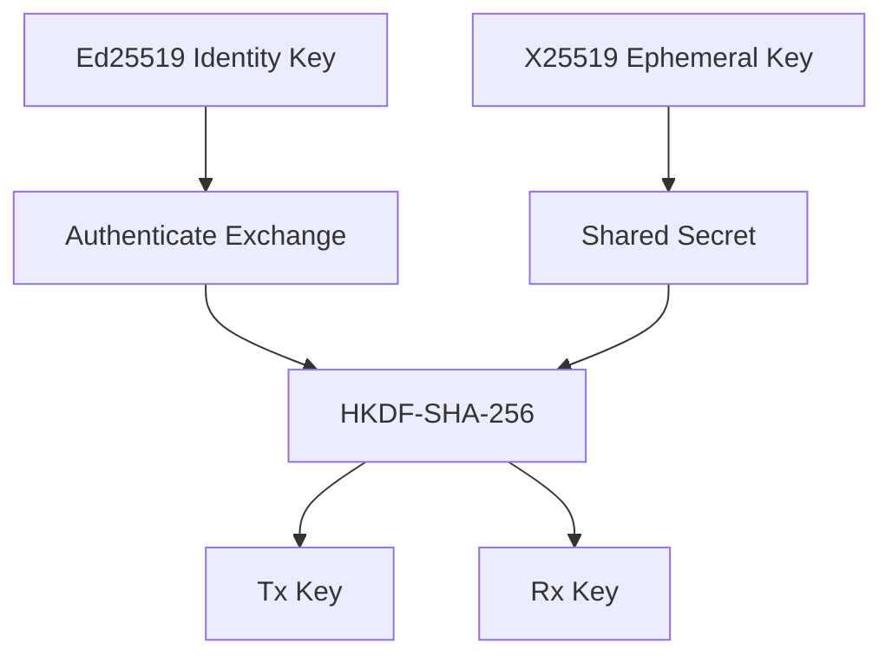

# Cryptographic Architecture

## Primitive selection

  Purpose                     Primitive           Status
  --------------------------- ------------------- -------------------
  Identity/signature          Ed25519             Implemented / verified
  Key agreement               X25519              Implemented / verified in M3
  Symmetric AEAD              ChaCha20-Poly1305   Accepted / future milestone
  KDF                         HKDF-SHA-256        Implemented / verified in M3
  Password KDF if needed      Argon2id            Conditional
  General hashing if needed   SHA-256/SHA-3       Context-dependent

## Principle

Use established implementations from mature cryptographic libraries.

Do not implement primitives from scratch.

## Key separation



## Current implementation boundary

The M2 Ed25519 long-term identity component and the M3 authenticated session
and message-protection layer are implemented and verified within their
approved scopes.

M3 establishes the cryptographic boundary:

```text
Ed25519 identity
      |
      v
signed X25519 ephemeral exchange
      |
      v
canonical handshake transcript
      |
      +--> session_id = SHA256(T_RESP)
      |
      v
HKDF-SHA-256
      |
      +--> initiator -> responder key
      +--> responder -> initiator key
      |
      v
ChaCha20-Poly1305
      |
      v
authenticated application ciphertext
```

The implementation uses established library primitives only. X25519 uses
Go's `crypto/ecdh`, Ed25519 uses the standard library, HKDF and ChaCha20-
Poly1305 use approved Go cryptographic libraries.

M3 does not implement direct networking or mesh routing. Relays therefore
remain outside the cryptographic session layer and must never receive
application plaintext or session keys.

See [[04-protocol/03-Session-Establishment]] and
[[05-cryptography/07-Cryptographic-Failure-Modes]].
