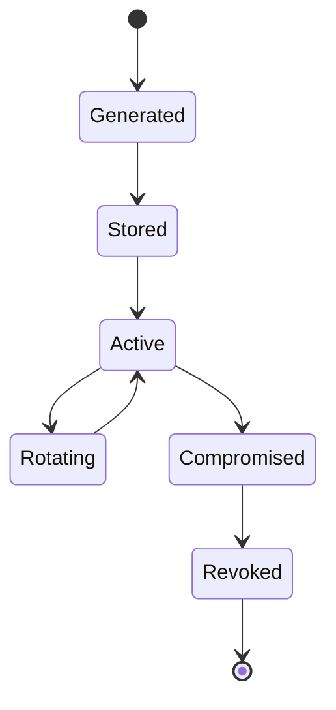

# Key Lifecycle

## Long-term identity key

## Session keys

Session keys are not implemented in M2. The approved future design
requires each session to have an explicit:

-   creation event
-   activation event
-   lifetime
-   rotation/rekey event
-   destruction/retirement event

The planned rotation threshold is 2^16 application messages or 24 hours,
whichever occurs first, subject to implementation and M3 review evidence.

## Reconnection

The implementation must define whether reconnecting:

-   resumes a session
-   establishes a new session
-   reauthenticates the existing identity
-   rotates session keys

No assumption should be left implicit.

## Compromise

If an identity key is compromised, the protocol must define how peers
detect and respond to the changed trust state.

## Storage

Document:

-   what is persistent
-   what is memory-only
-   what is encrypted at rest
-   what is backed up
-   what happens when state is lost
