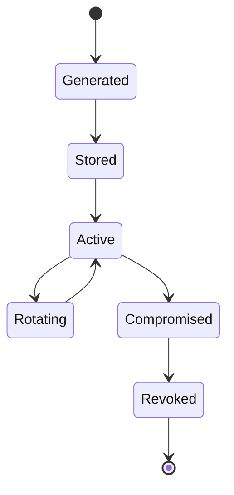

# Key Lifecycle

## Long-term identity key



## Session keys

M3 implements session keys and requires each session to have an explicit:

-   creation event
-   activation event
-   lifetime
-   rotation/rekey event
-   destruction/retirement event

The planned rotation threshold is 2^16 application messages or 24 hours,
whichever occurs first, as implemented and verified in M3.

## Reconnection

The implementation must define whether reconnecting:

-   resumes a session
-   establishes a new session
-   reauthenticates the existing identity
-   rotates session keys

No assumption should be left implicit.

## Compromise

If an identity key is compromised, the protocol must define how peers
detect and respond to the changed trust state.

## Storage

Document:

-   what is persistent
-   what is memory-only
-   what is encrypted at rest
-   what is backed up
-   what happens when state is lost


## M3 session lifecycle

```text
fresh X25519 ephemeral keys
        |
        v
authenticated handshake
        |
        v
directional session keys
        |
        v
encrypted messages + sequence state
        |
        +--> rotate at 2^16 messages or 24h
        |
        v
retire old session
```

Session keys and sequence/replay state are not persisted. Restart invalidates
the old session state and requires a fresh authenticated handshake.

Forward secrecy remains conditional on fresh ephemeral keys, appropriate
private-key lifecycle handling and uncompromised endpoints. The protocol
does not claim post-compromise security.
