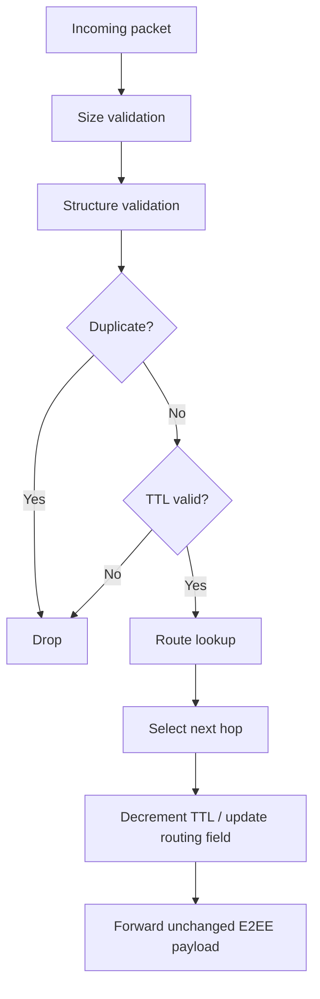

# Forwarding

## Forwarding pipeline

## Critical property

The forwarding engine should not modify cryptographic ciphertext or
authenticated E2EE fields except where the protocol explicitly defines a
routing-only field that is safe to update.

## Duplicate detection

The duplicate cache must be bounded to prevent an attacker from causing
unbounded memory growth.

## Forwarding failures

Possible outcomes:

-   no route
-   TTL expired
-   connection unavailable
-   duplicate
-   malformed packet
