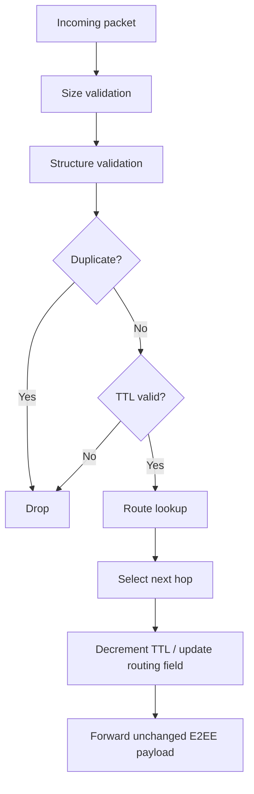

# Forwarding

## Forwarding pipeline

## Critical property

The forwarding engine should not modify cryptographic ciphertext or
authenticated E2EE fields except where the protocol explicitly defines a
routing-only field that is safe to update.

## Duplicate detection

The duplicate cache must be bounded to prevent an attacker from causing
unbounded memory growth.

## Forwarding failures

Possible outcomes:

-   no route
-   TTL expired
-   connection unavailable
-   duplicate
-   malformed packet

## M6 Forwarding Rules

Forwarding is best-effort and bounded. A packet is structurally validated before routing, duplicate-suppressed using `(source_node, packet_id)`, evaluated against TTL and destination, then enqueued to all eligible active peers except the incoming peer.

The forwarding queue is limited to 1,000 packets and 2 MiB per peer. Enqueue is non-blocking; either limit being reached causes a drop. The router does not perform network writes itself.

**Status: 🟢 COMPLETE / VERIFIED**

## M7 Forwarding Hardening

Router input validation occurs before duplicate-cache insertion and forwarding.
Oversized raw router input is rejected at the routing boundary. Forwarded
E2EE ciphertext remains opaque to relays.

**Status: 🟢 M7 VERIFIED**
