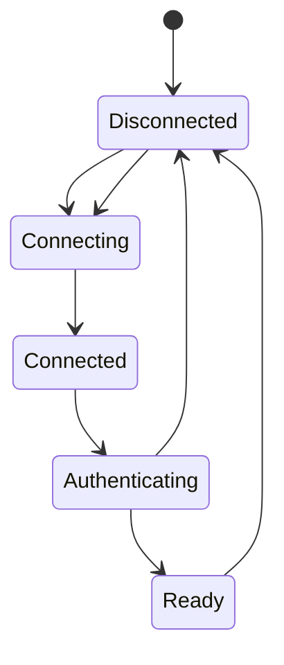
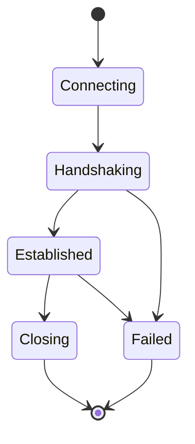

# Connection Management

## Responsibilities

-   establish connections
-   identify peers
-   maintain liveness
-   detect disconnects
-   reconnect where appropriate
-   enforce connection limits
-   apply timeouts

## Connection lifecycle

## Security

Connections are attacker-controlled boundaries.

Require:

-   bounded handshake size
-   timeouts
-   invalid-state rejection
-   connection limits
-   graceful shutdown

## Reconnection and crypto

A network reconnect does not automatically mean a cryptographic session
can safely be resumed.

The session policy must be explicit.

See [[04-protocol/03-Session-Establishment]].

## M4 Direct TCP Implementation

M4 implements the direct TCP connection boundary used by the secure channel.
Each frame has a 4-byte big-endian length prefix and a maximum 64 KiB body.
The receiver uses bounded `io.ReadFull` operations; the writer serializes
complete frames and handles short writes.

The connection contract is one receive-loop owner per connection. Concurrent
callers may write through the synchronized write path.

M4 uses one established M3 cryptographic session per direct channel. A fresh
handshake establishes the session after connection setup; a network reconnect
does not resume the old session automatically.

## M5 Direct Networking Runtime

M5 implements connection management through a `PeerManager` and per-connection
`Peer` objects above the M4 direct channel. Inbound and outbound connections
are authenticated through the existing M4 handshake APIs and become canonical
peers only after successful authentication.

### Peer lifecycle

`Closing` and `Failed` are terminal. Stale read-loop cleanup cannot resurrect
a terminal peer or remove a newer replacement from the registry.

### Duplicate connection arbitration

If both peers establish simultaneous direct connections, compare their 32-byte
Ed25519 identities. The connection initiated by the lexicographically smaller
identity wins. The registry replacement is atomic under the manager mutex; the
old connection is closed only after the replacement is installed.

### Resource limits

M5 bounds maximum active peers, pending handshakes and concurrent outbound
dials. Pending-handshake exhaustion rejects sockets immediately rather than
blocking the listener. Handshake and dial deadlines bound incomplete attempts.
Initial oversized frames are rejected before body allocation.

### Reconnect policy

Application-triggered reconnection is supported. The PeerManager does not
automatically reconnect. Every successful network reconnect establishes a fresh
M3 cryptographic session through M4; session resumption is not implemented.

### M5 validation

The runtime was validated with race detection, repeated race runs, explicit
four-case duplicate-arbitration tests and a deliberate Docker simultaneous-dial
collision between Dave and Bob.
