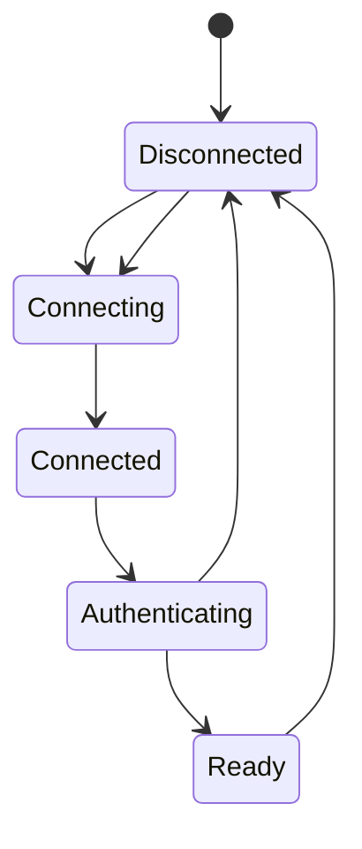

# Connection Management

## Responsibilities

-   establish connections
-   identify peers
-   maintain liveness
-   detect disconnects
-   reconnect where appropriate
-   enforce connection limits
-   apply timeouts

## Connection lifecycle

## Security

Connections are attacker-controlled boundaries.

Require:

-   bounded handshake size
-   timeouts
-   invalid-state rejection
-   connection limits
-   graceful shutdown

## Reconnection and crypto

A network reconnect does not automatically mean a cryptographic session
can safely be resumed.

The session policy must be explicit.

See [[04-protocol/03-Session-Establishment]].

## M4 Direct TCP Implementation

M4 implements the direct TCP connection boundary used by the secure channel.
Each frame has a 4-byte big-endian length prefix and a maximum 64 KiB body.
The receiver uses bounded `io.ReadFull` operations; the writer serializes
complete frames and handles short writes.

The connection contract is one receive-loop owner per connection. Concurrent
callers may write through the synchronized write path.

M4 uses one established M3 cryptographic session per direct channel. A fresh
handshake establishes the session after connection setup; a network reconnect
does not resume the old session automatically.
