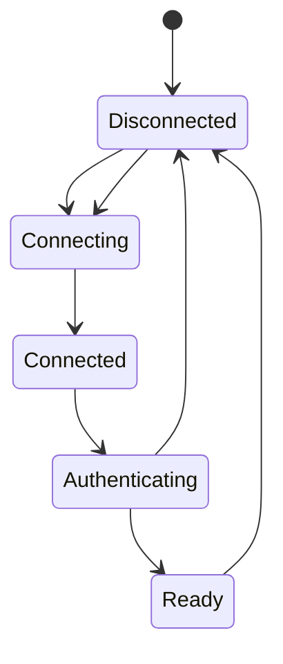

# Connection Management

## Responsibilities

-   establish connections
-   identify peers
-   maintain liveness
-   detect disconnects
-   reconnect where appropriate
-   enforce connection limits
-   apply timeouts

## Connection lifecycle

## Security

Connections are attacker-controlled boundaries.

Require:

-   bounded handshake size
-   timeouts
-   invalid-state rejection
-   connection limits
-   graceful shutdown

## Reconnection and crypto

A network reconnect does not automatically mean a cryptographic session
can safely be resumed.

The session policy must be explicit.

See [[04-protocol/03-Session-Establishment]].
