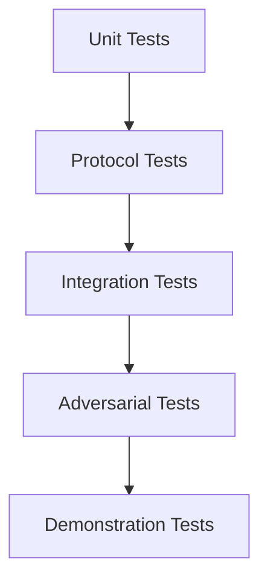

# Testing Strategy

## Testing layers

## Unit

Test individual:

- crypto wrappers
    
- serializers
    
- replay state
    
- routing functions
    
- validation functions
    

## Protocol

Test valid and invalid messages.

## Integration

Test multiple node processes.

## Adversarial

Assume packets and peers can be malicious.

## Demonstration

Reproduce the actual claims made in the final presentation.

## Security test philosophy

Every major security property must have at least one negative test.

Example:

> If we claim tampering is detected, a test must deliberately tamper  
> with authenticated data and expect rejection.

## Observability tests

Observability is part of the test surface.

Test at least:

- expected metrics for packet receive/forward/drop/expiry
    
- expected security events for replay and authentication failures
    
- absence of plaintext from relay logs
    
- absence of private/session keys from logs
    
- resistance to log injection through attacker-controlled fields
    
- bounded telemetry behavior under event floods
    
- continued message delivery when monitoring components are unavailable
    

The test suite should distinguish between:

1. **Telemetry correctness** — did the expected event/metric appear?
    
2. **Telemetry safety** — did the event avoid leaking protected data?
    
3. **Telemetry independence** — does the mesh still work without the  
    observability backend?