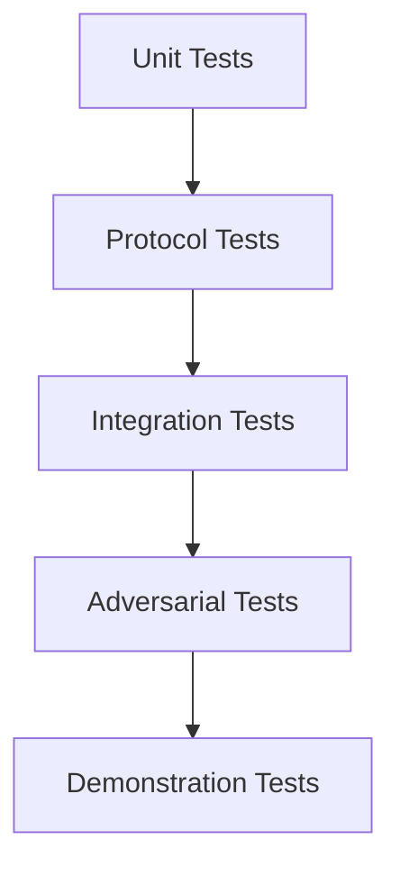

# Testing Strategy

## Testing layers



## Unit

Test individual:

-   crypto wrappers
-   serializers
-   replay state
-   routing functions
-   validation functions

## Protocol

Test valid and invalid messages.

## Integration

Test multiple node processes.

## Adversarial

Assume packets and peers can be malicious.

## Demonstration

Reproduce the actual claims made in the final presentation.

## Security test philosophy

Every major security property must have at least one negative test.

Example:

> If we claim tampering is detected, a test must deliberately tamper
> with authenticated data and expect rejection.

## Observability tests

Observability is part of the test surface.

Test at least:

- expected metrics for packet receive/forward/drop/expiry
- expected security events for replay and authentication failures
- absence of plaintext from relay logs
- absence of private/session keys from logs
- resistance to log injection through attacker-controlled fields
- bounded telemetry behavior under event floods
- continued message delivery when monitoring components are unavailable

The test suite should distinguish between:

1. **Telemetry correctness** — did the expected event/metric appear?
2. **Telemetry safety** — did the event avoid leaking protected data?
3. **Telemetry independence** — does the mesh still work without the
   observability backend?

## M2 Security Test Coverage

M2.1 testing covers:

- Ed25519 key generation and key-size invariants
- public/private correspondence
- deterministic signing
- modified-message rejection
- wrong-identity rejection
- malformed key/signature handling
- defensive copying of returned public keys
- defensive copying during private-key loading
- nil and empty-message behavior
- race-detector validation

The tests use freshly generated runtime keys and do not commit or print private
key material.


## M3 Security Test Coverage

M3.1 covers X25519 generation/agreement, RFC7748 known-answer behavior,
invalid/low-order public keys, ownership and lifecycle boundaries.

M3.2 covers authenticated handshake success/failure, transcript tampering,
identity substitution, ephemeral substitution, role/state confusion,
session-ID derivation, transcript sensitivity, HKDF known-answer values and
malformed inputs.

M3.3 covers deterministic nonce/AAD vectors, ciphertext modification,
authentication failures, truncation, duplicate messages, outside-window
messages, valid out-of-order messages, replay-state poisoning attempts,
cross-session and cross-direction rejection, sequence zero, exhaustion and
concurrent send/receive behavior.

The reported containerized validation sequence passed `gofmt`, `go vet`,
tests, race detection and build checks.


## M4 Direct Secure Messaging Evidence

M4 adds transport and end-to-end integration tests covering:

- 4-byte length-prefixed framing
- partial reads
- oversized frames
- short writes and failing writes
- concurrent write serialization
- unknown Protobuf field rejection
- protocol version and fixed-width field validation
- INIT/RESP/APP_DATA structural validation
- APP_DATA rejection before session establishment
- session/source/destination binding
- A-to-B and B-to-A encrypted message delivery
- ciphertext tampering on the transport path
- absence of application plaintext from intercepted transport bytes

M4 validation included formatting, vetting, unit/integration tests, race
detection and build validation in the controlled container environment.


## M5 Direct Networking Evidence

M5 testing covers the runtime peer-management layer above M4:

- pending-handshake exhaustion and immediate rejection
- active-peer exhaustion
- concurrent dial slot exhaustion and release
- oversized initial frame rejection before allocation
- malformed packet and wrong inbound identity rejection
- deterministic duplicate-arbitration permutations
- stale-peer/read-loop race behavior
- shutdown/read-loop race behavior
- concurrent send/close behavior
- repeated `Close()` safety
- terminal peer-state behavior
- blocking and failing telemetry isolation
- concurrent sends to multiple peers

The final duplicate-arbitration test covers all four combinations of local
identity ordering and inbound/outbound connection direction.

The reported validation passed:

```text
go test -race ./internal/mesh
go test -race ./internal/mesh -count=100
```

A deliberate Docker integration scenario simultaneously dials Dave and Bob in
both directions and verifies that the connection initiated by the smaller
identity survives with exactly one active peer on each side.

## M8 application/UI testing

M8 extends testing beyond the backend cryptographic/routing layers to the
application boundary and GUI state lifecycle.

Required checks include:

- application-service operation and error handling
- opaque routing-to-application delivery boundary
- absence of routing-layer decryption
- concurrent UI-state access under the race detector
- event processing
- send success/failure propagation
- GUI/application shutdown coordination
- headless backend regression

Interactive GUI smoke testing is an environment-dependent acceptance item and
must be reported separately from compile/test evidence.
