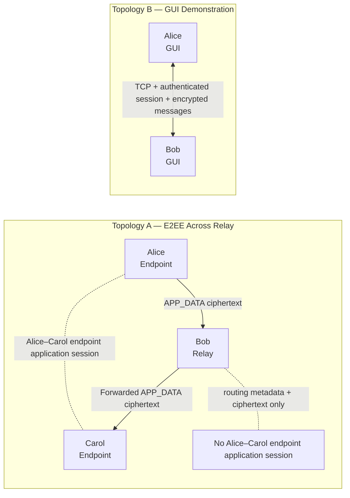

# M9 Topology

GitHub-renderable version of the M9 topology diagram.

```mermaid
flowchart LR
    subgraph A[Topology A — E2EE Across Relay]
        Alice[ Alice<br/>Endpoint ] -->|APP_DATA ciphertext| Bob[ Bob<br/>Relay ]
        Bob -->|Forwarded APP_DATA ciphertext| Carol[ Carol<br/>Endpoint ]
        Alice -. "Alice–Carol endpoint application session" .- Carol
        Bob -. "routing metadata + ciphertext only" .- X[No Alice–Carol endpoint application session]
    end

    subgraph B[Topology B — GUI Demonstration]
        Alice2[Alice<br/>GUI] <--> |TCP + authenticated session + encrypted messages| Bob2[Bob<br/>GUI]
    end
```

The original Mermaid source is also preserved in [`14-M9-Topology.mmd`](14-M9-Topology.mmd).
