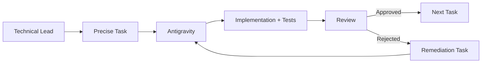

# Antigravity Workflow

## Roles

### Project Overseer

Responsible for:

-   architecture
-   security decisions
-   acceptance criteria
-   code review
-   security review
-   milestone approval

### Antigravity

Responsible for:

-   implementation
-   tests
-   diagnostics
-   reporting
-   proposed fixes

## Workflow

## Rules

Do not ask Antigravity to:

> "Build the entire project."

Instead provide:

-   objective
-   context
-   files
-   exact requirements
-   security constraints
-   tests
-   acceptance criteria
-   reporting format

## Never trust "done"

Antigravity's completion statement is evidence of what it believes it
did, not proof that the implementation is secure.

See [05-Definition-of-Done](05-Definition-of-Done.md).
