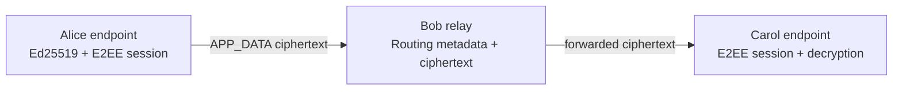
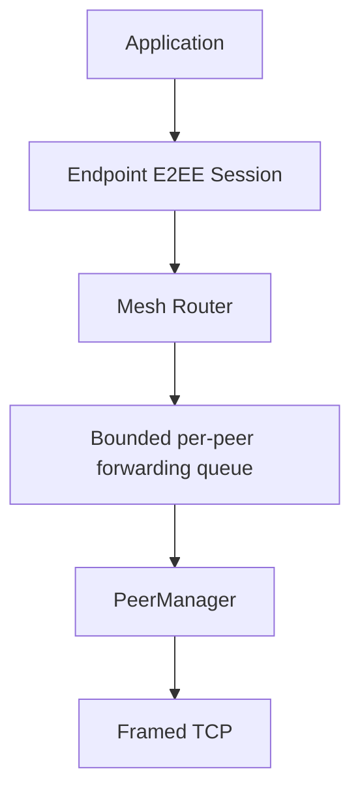

# System Technical Architecture

## Status

**M10.1 technical baseline — synchronized with the M9-closed implementation state.**

## Purpose

The system is an educational decentralized messaging prototype in which the
application payload is protected by an endpoint-to-endpoint cryptographic
session while the network layer transports the resulting ciphertext through
one or more peers.

The implementation is intentionally layered:

```text
Fyne GUI
   ↓
ApplicationService / Application Events
   ↓
Endpoint E2EE Session
   ↓
Mesh Router / bounded managed flooding
   ↓
Per-peer bounded forwarding
   ↓
PeerManager / direct TCP connections
   ↓
Length-prefixed transport
```

Protocol serialization is used at the packet boundary. Observability is an
out-of-band supporting subsystem.

## Architectural boundaries

### Application boundary

`internal/app` owns user-facing operations, conversations, events, and the
point at which endpoint plaintext is produced or consumed.

### Cryptographic boundary

`internal/crypto` owns long-term Ed25519 identity material, X25519 ephemeral
key agreement, authenticated session establishment, HKDF-derived directional
keys, and ChaCha20-Poly1305 message protection.

### Routing boundary

`internal/routing` validates the routing envelope and forwards packets. It does
not decrypt `APP_DATA`.

### Transport boundary

`internal/transport` provides bounded length-prefixed TCP framing and direct
channel behavior. `internal/mesh` manages authenticated peers and their direct
connections.

### Observability boundary

Telemetry is supporting and out-of-band. The current implementation contains
telemetry hooks and a non-blocking no-op recorder; an active Prometheus
exporter and Grafana deployment are not implemented.

## End-to-end trust relationship

For an application conversation between Alice and Carol through Bob:



Bob is a routing participant, not an endpoint of the Alice–Carol application
session. The implemented Bob `SessionManager` does not contain the Alice–Carol
endpoint application session required to decrypt that packet.

This is a statement about the implemented session ownership boundary; it is
not a claim of anonymity, metadata hiding, or protection against an endpoint
that is itself compromised.

## Direct versus mesh paths

A direct Alice–Bob connection and a multi-hop Alice–Bob path use the same
endpoint E2EE concept. The cryptographic relationship is independent of which
transport peer happens to carry the packet at each hop.



## Security invariant

> Routing may transport opaque application ciphertext, but endpoint
> decryption occurs only after the application layer resolves the appropriate
> authenticated session.

This invariant was explicitly corrected and validated during M8.1 and then
carried through M9 relay-blindness testing.

## Related records

- [01-System-Architecture](../02-architecture/01-System-Architecture.md)
- [03-Component-Architecture](../02-architecture/03-Component-Architecture.md)
- [04-Data-Flow](../02-architecture/04-Data-Flow.md)
- [05-Trust-Boundaries](../02-architecture/05-Trust-Boundaries.md)
- [01-Threat-Model](../03-security/01-Threat-Model.md)
- [20-M9-Final-Report](../07-testing/20-M9-Final-Report.md)
