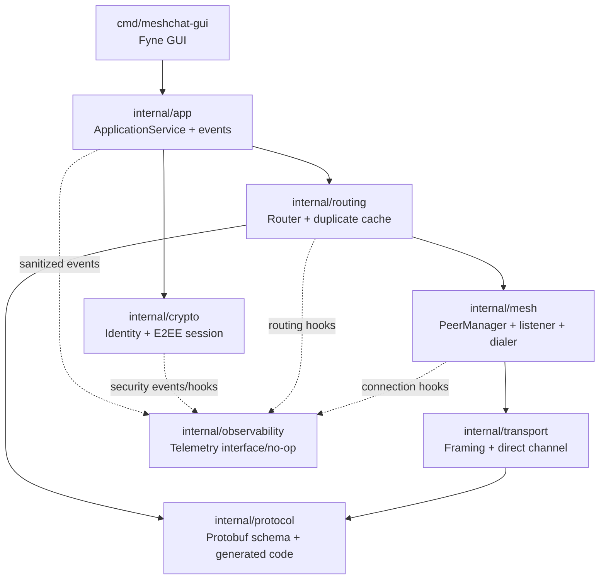

# Component Architecture — Implemented System

## Component map



## Responsibilities

| Component | Responsibility | Security boundary |
|---|---|---|
| Fyne GUI | User interaction and presentation | Receives application state, not cryptographic secrets |
| ApplicationService | Conversations, message send/receive, events, dialing | Endpoint plaintext boundary |
| `internal/crypto` | Identity, handshake, key derivation, AEAD | Owns secret cryptographic state |
| `internal/protocol` | Protobuf representation and generated code | Wire representation |
| `internal/routing` | Validation, TTL, duplicate suppression, forwarding | Must remain blind to APP_DATA plaintext |
| `internal/mesh` | Peer lifecycle and direct connections | Authenticated peer admission and resource bounds |
| `internal/transport` | Framing and direct channels | 64 KiB framing boundary |
| `internal/observability` | Supporting telemetry hooks | Must not receive plaintext or secret keys |

## ApplicationService boundary

The application API includes operations corresponding to conversation startup,
dialing, message sending, lifecycle, and event subscription. Lower-level
cryptographic and routing objects are not exposed as GUI responsibilities.

The inbound path is:

```text
network packet
  ↓
routing validation
  ↓
opaque APP_DATA(session_id, sequence_num, ciphertext)
  ↓
ApplicationService
  ↓
authenticated session lookup
  ↓
ChaCha20-Poly1305 decryption
  ↓
MessageReceived event
  ↓
GUI
```

## Peer identity versus address

The system distinguishes:

```text
PeerID          = authenticated Ed25519 public identity
NetworkAddress  = transport location used for dialing
Conversation    = application relationship identified by PeerID
```

A TCP address alone does not establish the application identity.

## Relay boundary

A relay may inspect the routing information required for forwarding and may
process TTL and duplicate suppression. It does not require the endpoint
application session keys for the forwarded application message.

## Observability boundary

The current telemetry implementation is a supporting hook/no-op recorder.
The architecture reserves telemetry for bounded operational and security
signals; private keys, session keys, passwords, and application plaintext are
not telemetry payloads.

## Related records

- [03-Component-Architecture](../02-architecture/03-Component-Architecture.md)
- [08-Application-Service-Boundary](../02-architecture/08-Application-Service-Boundary.md)
- [07-Observability-and-Security-Telemetry](../02-architecture/07-Observability-and-Security-Telemetry.md)
