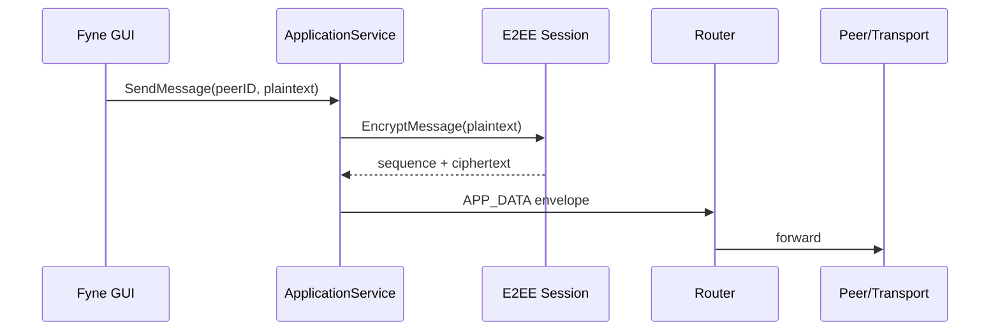
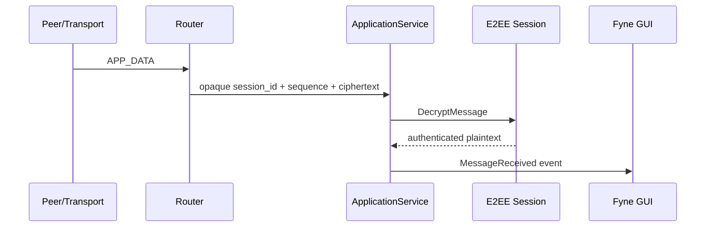

# Application and GUI Implementation

## Application layer

The application layer in `internal/app` provides a controlled facade between
the user interface and the secure mesh backend.

Primary responsibilities include:

- dialing a network address with optional expected PeerID validation
- starting a conversation after authenticated peer establishment
- sending application plaintext through the correct endpoint session
- receiving/decrypting APP_DATA at the endpoint
- maintaining in-memory conversation state
- publishing application events
- coordinated startup and shutdown

## Outbound message flow



## Inbound message flow



## Critical boundary

The router never becomes a plaintext processing layer. This is a hard
architectural invariant:

> `internal/routing` forwards APP_DATA without decrypting it.

The endpoint application layer resolves the session and invokes decryption.

## GUI

The presentation client uses Fyne and is launched through:

```text
cmd/meshchat-gui
```

The GUI is responsible for:

- local public identity display/copying
- peer entry
- connection status
- secure-session status
- conversation selection
- message entry
- message display

The GUI does not own private keys, session keys, AEAD state, raw sockets,
handshake construction, or routing decisions.

## Identity presentation

The GUI may expose the local public Ed25519 identity and shortened PeerIDs.
It must not receive or display private cryptographic material.

A PeerID and a network address remain distinct concepts.

## Session status

The interface distinguishes transport connection from authenticated secure
session establishment. A TCP connection alone is not represented as a secure
application session.

## Lifecycle

The application event consumer has an explicit shutdown path. GUI shutdown
signals the consumer and waits for it before backend teardown, preventing a
live consumer from racing with service shutdown.

## M9 verification boundary

M9.3 was manually verified by the Project Director on the
actual desktop. The verified scenarios included identity display, secure
session establishment, bidirectional messaging, duplicate Add Peer behavior,
and wrong-PeerID behavior.

Automated GUI interaction was unavailable in the headless environment and is
not represented as automated evidence.

## Related records

- [[02-architecture/08-Application-Service-Boundary]]
- [[07-testing/12-M8.3-Acceptance-Evidence]]
- [[07-testing/18-M9-GUI-Evidence]]
- [[07-testing/20-M9-Final-Report]]
