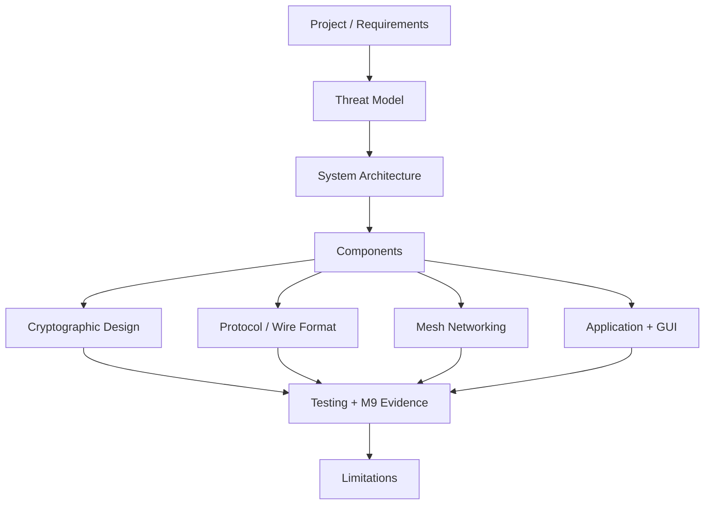

# M10.1 Technical Documentation Map

## Status

**M10.1 — PASS / documentation gate ready for Overseer review.**

## Purpose

M10.1 establishes a coherent technical description of the implementation using
the approved M9 baseline.

## Documentation chain

## New M10.1 technical pages

- [[10-technical-documentation/01-System-Technical-Architecture]]
- [[10-technical-documentation/02-Component-Architecture]]
- [[10-technical-documentation/03-Cryptographic-Design]]
- [[10-technical-documentation/04-Protocol-and-Wire-Format]]
- [[10-technical-documentation/05-Mesh-Networking-and-Forwarding]]
- [[10-technical-documentation/06-Application-and-GUI-Implementation]]
- [[10-technical-documentation/07-Implementation-and-Reproducibility-Baseline]]

## Source-of-truth rule

These pages summarize the implemented system. The protocol, security, testing,
and milestone records remain authoritative for their specific details.

M10 documentation must not silently upgrade an architectural intention into
an implemented feature.
