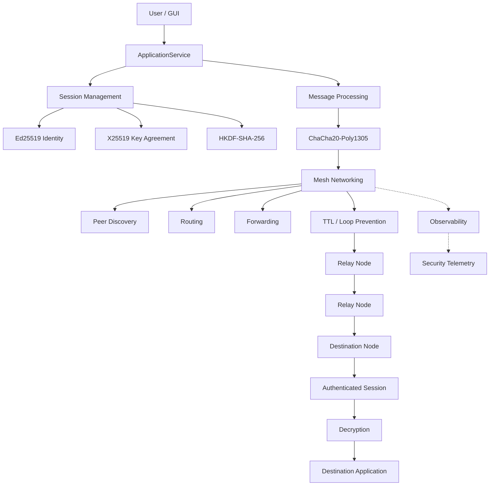

# E2EE Mesh Chat

### End-to-End Encrypted Messaging over a Decentralized Mesh Network

> **Status:** 🟢 Final Engineering Validation — PASS  
> **Project State:** Documentation Frozen  
> **Project Type:** Academic Cybersecurity & Networking Prototype

E2EE Mesh Chat is a secure messaging system designed to provide **end-to-end encrypted communication over a decentralized, multi-hop mesh network**.

The project combines applied cryptography, computer networking, distributed systems, peer-to-peer communication, secure software engineering, and security testing into a single experimentally validated system.

The complete engineering and academic documentation is maintained as an **Obsidian knowledge base** inside this repository.

---

## 🔐 Core Security Model

The system is designed around the principle:

> **Security > Correctness > Simplicity > Performance > Features**

Endpoint application data remains encrypted throughout the mesh.

Intermediate relay nodes can participate in routing and forwarding but **cannot decrypt endpoint application messages**.

The system uses:

|Security Component|Technology|
|---|---|
|Node Identity|Ed25519|
|Key Agreement|X25519|
|Key Derivation|HKDF-SHA-256|
|Message Encryption|ChaCha20-Poly1305|
|Replay Protection|Sequence / replay controls|
|Transport|Bounded TCP|
|Routing|Authenticated multi-peer mesh|
|Forwarding|Bounded multi-hop forwarding|
|Application Boundary|ApplicationService|
|Observability|Out-of-band telemetry|

---

## 🏗️ System Architecture



### Security Boundary

```text
┌──────────────────────────────────────────────────────────────┐
│                         ENDPOINT A                            │
│                                                              │
│  Application                                                 │
│       │                                                      │
│       ▼                                                      │
│  ApplicationService                                          │
│       │                                                      │
│       ▼                                                      │
│  Session / Cryptography                                      │
│       │                                                      │
│       ▼                                                      │
│  Encrypted Application Data                                  │
└──────────────────────────┬───────────────────────────────────┘
                           │
                           │ Ciphertext
                           ▼
                 ┌───────────────────┐
                 │    Relay Node     │
                 │                   │
                 │ Routing           │
                 │ Forwarding        │
                 │ TTL / Bounds      │
                 └─────────┬─────────┘
                           │
                           │ Ciphertext
                           ▼
                 ┌───────────────────┐
                 │    Relay Node     │
                 └─────────┬─────────┘
                           │
                           │ Ciphertext
                           ▼
┌──────────────────────────┴───────────────────────────────────┐
│                         ENDPOINT B                            │
│                                                              │
│  Receive → Authenticate → Decrypt → Application              │
└──────────────────────────────────────────────────────────────┘
```

**Important:** relay infrastructure is not trusted with endpoint plaintext.

---

# 📚 Documentation

The complete documentation lives under:

**`Noctis Documentation (Obsidian)/e2ee-mesh-chat/`**

### Start Here

- Project Overview
    
- Requirements
    
- Threat Model
    
- System Architecture
    
- Architecture Decisions
    
- Protocol Overview
    
- Cryptographic Architecture
    
- Mesh Architecture
    
- Testing Strategy
    
- Milestones
    

---

## 🧭 Documentation Map

### 00 — Governance

Project decisions, architecture reviews, project state, validation gates, and documentation governance.

Browse Governance Documentation

### 01 — Project

Project scope, requirements, objectives, assumptions, and constraints.

Browse Project Documentation

### 02 — Architecture

System architecture, component architecture, data flow, trust boundaries, deployment architecture, and architecture decisions.

Browse Architecture Documentation

### 03 — Security

Threat model, security goals, attack surface, security controls, limitations, and security review checklists.

Browse Security Documentation

### 04 — Protocol

Protocol overview, node identity, session establishment, message format, mesh packet format, replay protection, state machines, and error handling.

Browse Protocol Documentation

### 05 — Cryptography

Cryptographic architecture, identity and signatures, key agreement, key derivation, AEAD, nonce management, key lifecycle, and cryptographic failure modes.

Browse Cryptography Documentation

### 06 — Networking

Mesh architecture, peer discovery, routing, forwarding, TTL controls, connection management, handshake correlation, and resource bounds.

Browse Networking Documentation

### 07 — Testing & Evidence

Testing strategy, cryptographic tests, protocol tests, network tests, security demonstrations, acceptance evidence, attack evidence, topology, logs, and final validation reports.

Browse Testing Documentation

### 08 — Implementation

Milestones, task templates, code review standards, development workflow, and Definition of Done.

Browse Implementation Documentation

### 09 — Academic

Abstract, problem statement, objectives, methodology, security analysis, results, limitations, future work, and viva preparation.

Browse Academic Documentation

### 10 — Technical Documentation

Final technical documentation, experimental methodology, security analysis, documentation audits, and evidence matrices.

Browse Technical Documentation

### 📑 Final Academic Package

- Academic Report
    
- Presentation Outline
    
- Viva Q&A
    
- Evidence Index
    

---

# 🛡️ Security Architecture

The system establishes authenticated sessions using:

```text
Ed25519 Identity
       │
       ▼
Authenticated X25519 Key Agreement
       │
       ▼
Transcript-Bound HKDF-SHA-256
       │
       ▼
Session Encryption Keys
       │
       ▼
ChaCha20-Poly1305
       │
       ▼
Encrypted Application Messages
```

This provides separation between:

- long-term node identity
    
- ephemeral/session key agreement
    
- derived session keys
    
- application message encryption
    
- mesh routing metadata
    

The mesh therefore transports encrypted application traffic without requiring relay nodes to possess endpoint decryption keys.

---

# 🌐 Mesh Networking

The networking layer supports:

- authenticated peers
    
- peer discovery
    
- multi-peer communication
    
- bounded routing
    
- multi-hop forwarding
    
- TTL-based loop prevention
    
- connection management
    
- resource bounds
    
- authenticated network handshakes
    

The architecture is designed so that routing infrastructure handles **where encrypted data should go**, rather than **what the encrypted data means**.

---

# 🧪 Validation

The project progressed through **M0–M10.3** engineering and documentation milestones.

### Final status

|Area|Status|
|---|---|
|Core Architecture|🟢 Verified|
|Node Identity|🟢 Verified|
|Session Establishment|🟢 Verified|
|Key Derivation|🟢 Verified|
|Application Encryption|🟢 Verified|
|Replay Protection|🟢 Verified|
|TCP Transport|🟢 Verified|
|Multi-Peer Networking|🟢 Verified|
|Multi-Hop Forwarding|🟢 Verified|
|Security Hardening|🟢 Verified|
|ApplicationService Boundary|🟢 Verified|
|GUI Integration|🟢 Accepted|
|M8.3 Integration|🟢 Passed|
|M9 Validation|🟢 Approved|
|M10 Documentation|🟢 Complete|
|Academic Deliverables|🟢 Complete|
|Final System Validation|🟢 PASS|

### Validation notes

Final validation passed for the executable checks available in the validation environment.

The previously accepted M8/M9 manual GUI evidence remains part of the evidence baseline.

Docker regression testing remains **unverified** where external dependency resolution was blocked by proxy/DNS restrictions.

Final GUI re-execution in a headless environment is explicitly **NOT MEASURED**.

These limitations are documented rather than silently treated as successful tests.

---

# 🔍 Evidence-Driven Engineering

A central principle of this project is:

> **An implementation claim is not considered verified without supporting evidence.**

The documentation therefore distinguishes between:

- **Proposed**
    
- **Accepted**
    
- **Implemented**
    
- **Verified**
    
- **Approved**
    
- **Rejected**
    
- **Deferred**
    

This distinction prevents architectural proposals from being incorrectly represented as implemented functionality.

---

# 📊 Project Development

```text
M0
│
├── Requirements & Scope
│
M1–M4
│
├── Architecture
├── Cryptography
├── Protocol
└── Networking
│
M5–M7
│
├── Security Hardening
├── Mesh Validation
└── Acceptance Evidence
│
M8
│
├── ApplicationService
├── GUI Integration
└── End-to-End Application Testing
│
M9
│
├── Final Environment
├── Multi-Hop Validation
├── Attack Evidence
└── Final Engineering Review
│
M10
│
├── Technical Documentation
├── Experimental Evaluation
├── Security Analysis
└── Academic Deliverables
│
▼
FINAL VALIDATION — PASS
```

---

# 📂 Repository Structure

```text
.
├── README.md
│
└── Noctis Documentation (Obsidian)/
    └── e2ee-mesh-chat/
        ├── 00-governance/
        ├── 01-project/
        ├── 02-architecture/
        ├── 03-security/
        ├── 04-protocol/
        ├── 05-cryptography/
        ├── 06-networking/
        ├── 07-testing/
        ├── 08-implementation/
        ├── 09-academics/
        ├── 10-technical-documentation/
        └── Summarized Presentable Structured Reports/
```

The `e2ee-mesh-chat` directory is maintained as an **Obsidian vault**, while this root README provides a GitHub-friendly entry point for readers who do not use Obsidian.

---

# 🎓 Academic Context

This project demonstrates the practical integration of:

- Applied Cryptography
    
- Network Security
    
- End-to-End Encryption
    
- Peer-to-Peer Networking
    
- Mesh Networking
    
- Distributed Systems
    
- Secure Protocol Design
    
- Threat Modeling
    
- Security Testing
    
- Software Architecture
    
- Experimental Validation
    

It is intended to serve both as an engineering artifact and as an academic research/project submission.

---

# ⚠️ Scope & Limitations

This is an **academic cybersecurity and networking prototype**, not a production-ready secure messenger.

The documentation explicitly records known limitations, assumptions, environmental constraints, and unmeasured validation areas.

The system should therefore not be interpreted as independently audited or production-certified cryptographic software.

---

# 📖 Documentation-First Design

The project documentation is intentionally maintained as a structured Obsidian knowledge base rather than a single monolithic document.

This allows architecture, security, protocol, cryptography, networking, testing, implementation, and academic material to remain independently navigable while preserving cross-references between them.

For the complete engineering record, start with the:

**Obsidian Vault Documentation**

---

# 👤 Project

**E2EE Mesh Chat**

End-to-End Encrypted Messaging over a Decentralized Mesh Network

**Documentation:** Obsidian  
**Validation:** M0–M10.3  
**Final Status:** 🟢 PASS

---

> **Security claims are backed by implementation evidence and testing wherever measurable.**
> 
> **Documentation frozen after final technical and academic validation.**