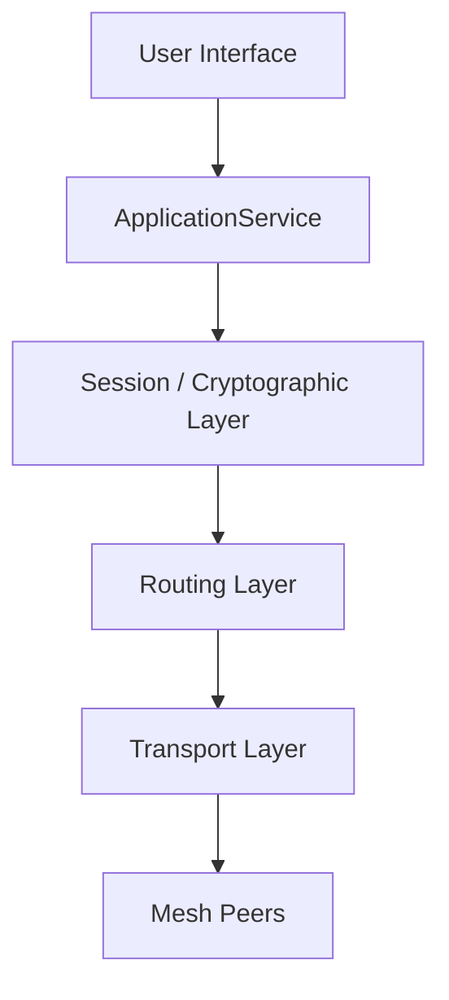
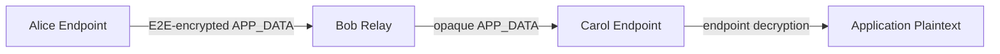

# Academic Report
## Design and Implementation of an End-to-End Encrypted Messaging System over a Decentralized Mesh Network

### 1. Title Page Information
- **Project Title:** Design and Implementation of an End-to-End Encrypted Messaging System over a Decentralized Mesh Network
- **Project Director / Final Authority:** Sanchay Jain
- **Project Overseer / Security Architect / Technical Lead:** Jarvis
- **Implementation/Test Agent:** Antigravity

### 2. Abstract
This project presents the design, implementation, and evaluation of a decentralized mesh networking system providing secure end-to-end encrypted (E2EE) messaging. The system uses bounded managed flooding for multi-hop forwarding and cryptographic identities for authenticated communication. Ed25519 is used for identity signatures, X25519 for key agreement, HKDF-SHA-256 for key derivation, and ChaCha20-Poly1305 for authenticated encryption. Security validation covered ciphertext tampering, identity/peer verification, replay, malformed packets, TTL enforcement, duplicate suppression, and bounded pending handshakes. Controlled loopback experiments measured application delivery throughput of approximately 1,854 messages/s for 1 KiB payloads and mean multi-hop application latency of 0.122 ms for 1 KiB payloads. The project explicitly does not claim Internet-scale performance, perfect anonymity, complete metadata hiding, guaranteed delivery, or operational deployment readiness.

### 3. Keywords
Decentralized Mesh Networking, End-to-End Encryption, E2EE, Cryptographic Identity, Bounded Managed Flooding, Multi-Hop Forwarding, Ed25519, X25519, ChaCha20-Poly1305, HKDF.

### 4. Introduction
Traditional messaging architectures commonly depend on centralized infrastructure, creating concentrated trust and availability dependencies. A decentralized mesh distributes forwarding responsibility among participating peers. This project explores an architecture in which routing and endpoint cryptography are deliberately separated: intermediate peers forward opaque application packets while endpoint nodes perform authenticated session establishment and application encryption/decryption.

### 5. Problem Statement
Design and implement a messaging system that enables end-to-end encrypted communication over a decentralized multi-hop mesh without relying on a central messaging server, while mitigating localized threats such as packet observation, modification, replay, malformed input, and unauthorized impersonation.

### 6. Motivation
The project is motivated by resilient communication scenarios such as ad-hoc networks and environments where centralized infrastructure may be unavailable or undesirable. The design investigates whether a simple bounded flooding model can provide multi-hop connectivity while maintaining a strict E2EE boundary.

### 7. Objectives
1. Implement a decentralized mesh using bounded managed flooding.
2. Provide Ed25519-based cryptographic identities.
3. Establish authenticated sessions using X25519 and HKDF.
4. Protect application payloads with ChaCha20-Poly1305.
5. Forward opaque ciphertext through intermediate nodes.
6. Validate security controls against tampering, replay, malformed input, impersonation, and resource-exhaustion conditions.
7. Measure baseline local performance.

### 8. Scope
The scope covers identity, authenticated session establishment, encrypted application messaging, TCP transport, peer management, bounded flooding, duplicate suppression, TTL enforcement, security validation, GUI operation, and controlled performance measurement. Perfect anonymity, global traffic-analysis resistance, complete metadata hiding, deniability, compromised-endpoint protection, guaranteed delivery, comprehensive routing-attack resistance, and production deployment readiness are outside the demonstrated scope.

### 9. Threat Model

#### Protected / Mitigated
- **Ciphertext observation:** application payloads are protected by endpoint AEAD encryption.
- **Ciphertext modification:** authenticated decryption rejects modified ciphertext.
- **Replay:** sequence-number/replay-window logic rejects duplicate or stale ciphertext.
- **Malformed input:** runtime protocol validation rejects non-compliant packets.
- **Impersonation:** authenticated handshake signatures bind ephemeral exchange to long-term identities.
- **Resource exhaustion:** frame, queue, TTL, peer, cache, and pending-handshake bounds constrain resource use.

#### Not Fully Solved / Out of Scope
- Perfect anonymity and global traffic-analysis resistance.
- Complete metadata hiding.
- Deniability.
- Compromised endpoint protection.
- Guaranteed message delivery.
- Full protection against all routing attacks.
- Internet-scale adversarial DoS readiness.

**Trust model note:** TOFU can detect later identity changes after an identity has been trusted, but first contact is not authenticated against an active MITM attacker.

### 10. System Requirements
- **Language:** Go
- **Tested Go version:** go1.21.13 linux/amd64
- **Transport:** TCP
- **Serialization:** Protocol Buffers
- **GUI:** Fyne
- **Test environment:** Ubuntu 24.04.1, AMD Ryzen 7 5700G, 14 GiB RAM
- **Frame limit:** 64 KiB
- **Pending handshakes:** maximum 10
- **Active peers:** maximum 50

### 11. Related Concepts / Background
E2EE protects application content from intermediate forwarding infrastructure. Mesh networking allows participating nodes to relay packets across multiple hops. Ed25519 supplies digital signatures for identity authentication, while X25519 provides ephemeral key agreement. HKDF derives independent session keys from the shared secret, and ChaCha20-Poly1305 provides authenticated encryption.

### 12. System Architecture



The architecture separates endpoint cryptography from mesh routing. Observability, where present, is an out-of-band supporting subsystem and is not part of the E2EE data path.

### 13. Network Architecture
Direct peer communication uses TCP. Peer management maintains peer state and connection lifecycles while enforcing resource limits. Transport uses a 4-byte length prefix and rejects frames exceeding the 64 KiB limit before excessive allocation. Mesh forwarding uses bounded managed flooding, TTL, and duplicate suppression.

### 14. Cryptographic Architecture

| Function | Primitive |
|---|---|
| Identity/signature | Ed25519 |
| Key agreement | X25519 |
| AEAD | ChaCha20-Poly1305 |
| KDF | HKDF-SHA-256 |
| Password KDF where applicable | Argon2id |
| Hashing | SHA-256 |

#### Frozen handshake transcript

```text
DOMAIN = "MeshChat-Handshake-v1"
PROTOCOL_VERSION = 0x01
ZERO32 = 32 zero bytes

T_INIT = DOMAIN || u8(PROTOCOL_VERSION) || ID_A || ID_B || E_A || ZERO32
T_RESP = DOMAIN || u8(PROTOCOL_VERSION) || ID_A || ID_B || E_A || E_B
```

Alice signs `T_INIT`; Bob signs `T_RESP`.

```text
session_id = SHA256(T_RESP)
salt = SHA256(T_RESP)
PRK = HKDF-Extract(salt, SS)

K_A_to_B = HKDF-Expand(
    PRK,
    "MeshChat-v1|session|initiator->responder",
    32
)

K_B_to_A = HKDF-Expand(
    PRK,
    "MeshChat-v1|session|responder->initiator",
    32
)
```

The implementation uses fresh ephemeral X25519 keys for session establishment. Forward secrecy is conditional on ephemeral-key freshness and appropriate key lifecycle/erasure; the project does not implement post-compromise security or a Signal-style ratchet.

### 15. Protocol Design
The wire protocol uses Protocol Buffers with explicit runtime validation. The system validates packet version, type/`oneof` consistency, field lengths, source/destination identity sizes, session binding, ciphertext limits, and unknown-field policy. Protobuf serialization itself is not treated as a substitute for these semantic security checks.

APP_DATA carries a session identifier, sequence number, and ciphertext. The routing layer forwards this payload opaquely.

### 16. Mesh Routing and Forwarding
Routing uses **bounded managed flooding**, not a DHT or route-selection algorithm.

Key controls:
- TTL limits packet lifetime.
- A bounded seen-cache suppresses duplicates.
- The duplicate key is `(source_node, packet_id)`.
- `PacketID` is locally generated by the source node and is not claimed to be globally unique.
- Forwarding queues are bounded.
- Peer and pending-handshake counts are bounded.



The routing layer does not require the endpoint session keys. Relay blindness was independently validated in M9.1 using test-local observation.

### 17. Application and GUI Architecture
`ApplicationService` coordinates identity initialization, session requests, message encapsulation, routing, and delivery events. The Fyne GUI communicates through the application service rather than directly implementing cryptographic or routing behavior. M9.3 manually validated identity display, secure session establishment, bidirectional messaging, duplicate connection handling, and wrong-peer rejection.

### 18. Implementation
The system is implemented in Go. Concurrent peer operations use goroutines, channels, and mutexes. Peer management controls connection lifecycle, while the router validates and forwards mesh packets. The endpoint application/crypto layer remains separate from routing.

### 19. Security Design
Security is layered:
1. Transport bounds frame size.
2. Routing validates envelopes, TTL, and duplicates.
3. Session establishment authenticates identities and derives endpoint keys.
4. ChaCha20-Poly1305 provides confidentiality and integrity.
5. Sequence numbers and a replay window reject duplicate/stale ciphertext.
6. Session/key lifecycle limits reduce long-lived key exposure.
7. Resource limits constrain pending handshakes, peers, queues, and caches.

### 20. Security Validation
M9 security validation demonstrated:
1. Wrong PeerID rejection.
2. Ciphertext tampering rejection.
3. AEAD replay rejection.
4. Invalid signature rejection.
5. Malformed packet rejection.
6. TTL enforcement.
7. PacketID duplicate suppression.
8. Pending-handshake bound enforcement (`MaxPendingHandshakes = 10`).

M9.1 separately established relay blindness using test-local observation. M9.3 validated the user-facing GUI behavior.

### 21. Experimental Methodology
M10.2 used an isolated benchmark harness against unmodified production APIs. Nodes ran on loopback (`127.0.0.1`). Warm-up traffic was excluded from measured latency trials. Latency represents one-way application-level delivery timing. Throughput represents successfully delivered application payloads rather than raw TCP throughput.

### 22. Experimental Results
**All results below are LOCAL LOOPBACK EXPERIMENTAL RESULTS. They are not Internet deployment benchmarks.**

#### Cryptography
- X25519 shared-secret computation: ~39.6 µs/op.
- Ed25519 signing: ~20.3 µs/op.
- Ed25519 verification: ~46.0 µs/op.
- ChaCha20-Poly1305 encryption: ~1.9 µs/op at 4 KiB.
- AEAD decryption performance: **NOT MEASURED** because the initial benchmark triggered production replay protection.

#### Direct latency

| Payload | Min (ms) | Mean (ms) | Median (ms) | P95 (ms) | P99 (ms) | Max (ms) |
|---|---:|---:|---:|---:|---:|---:|
| 64 B | 0.008 | 0.063 | 0.049 | 0.119 | 0.438 | 0.479 |
| 256 B | 0.013 | 0.068 | 0.066 | 0.129 | 0.268 | 0.351 |
| 1 KiB | 0.015 | 0.063 | 0.052 | 0.145 | 0.220 | 0.224 |
| 4 KiB | 0.019 | 0.073 | 0.069 | 0.143 | 0.222 | 0.335 |

#### Multi-hop latency

| Payload | Min (ms) | Mean (ms) | Median (ms) | P95 (ms) | P99 (ms) | Max (ms) |
|---|---:|---:|---:|---:|---:|---:|
| 64 B | 0.008 | 0.073 | 0.067 | 0.161 | 0.223 | 0.327 |
| 256 B | 0.011 | 0.092 | 0.070 | 0.257 | 0.286 | 0.292 |
| 1 KiB | 0.015 | 0.122 | 0.099 | 0.335 | 0.408 | 0.426 |
| 4 KiB | 0.018 | 0.132 | 0.104 | 0.331 | 0.382 | 0.393 |

#### Application delivery throughput
- 5,000 × 1 KiB attempted.
- 5,000 delivered.
- 0 lost.
- 0 duplicates.
- 2.696 s elapsed.
- ≈1,854 messages/s.
- ≈1,899,109 payload bytes/s (≈1.81 MiB/s).

#### Message size
60 KiB was the largest tested application payload and achieved 100/100 successful delivery trials.

#### Resource usage
- Maximum RSS: ~96 MiB.
- User CPU time: 3.08 s.
- System CPU time: 1.03 s.
- CPU utilization percentage: **NOT MEASURED**.

#### Handshake repeatability
- 50 sequential full handshakes completed.
- Concurrent handshake scaling: **NOT MEASURED**.

### 23. Results and Discussion
The experiments establish a local performance baseline for the implemented software stack. For 1 KiB payloads, mean direct application latency was 0.063 ms, while the tested Alice-to-Bob-to-Carol topology produced a mean of 0.122 ms. The throughput experiment delivered all 5,000 attempted messages with no observed loss or duplicates. The 60 KiB application-payload test also completed successfully across the tested implementation.

These measurements should not be interpreted as Internet performance because they were obtained on loopback. They primarily characterize local software, serialization, cryptographic, scheduling, and TCP processing behavior.

### 24. Performance Analysis
The tested implementation handled payloads from 64 B through 60 KiB and sustained approximately 1,854 delivered 1 KiB messages per second in the local throughput experiment. Memory and CPU time were measured using an OS-level process measurement. CPU utilization percentage was not established.

### 25. Security Analysis
The central security boundary is endpoint-to-endpoint encryption. Intermediate relays forward routing metadata and opaque application ciphertext rather than application plaintext. M9.1 provides the independent relay-blindness evidence. M9.2 demonstrated rejection of tampering, replay, invalid signatures, malformed packets, expired TTLs, duplicate packets, and excessive pending handshakes.

The architecture does not attempt to hide all metadata. Source/destination identifiers, packet timing, and other routing information remain observable to participating relays.

### 26. Limitations
- Loopback-only performance environment.
- No realistic WAN latency, jitter, or packet-loss campaign.
- No adversarial DoS performance campaign.
- No perfect anonymity or global traffic-analysis resistance.
- No complete metadata hiding.
- No compromised-endpoint protection.
- No deniability guarantee.
- No guaranteed delivery acknowledgments.
- Concurrent handshake scaling not measured.
- AEAD decryption performance not measured.
- CPU utilization percentage not measured.
- No operational deployment-readiness claim.

### 27. Future Work
Potential extensions include WAN/network impairment testing, larger mesh experiments, more efficient route discovery/selection research, stronger routing-attack resistance, richer metadata protection, post-compromise security, persistent/offline messaging, and concurrent handshake performance studies.

### 28. Conclusion
The project successfully implemented a decentralized E2EE messaging prototype in which endpoint cryptography is separated from mesh forwarding. Ed25519 identities, X25519 key agreement, HKDF-derived session keys, and ChaCha20-Poly1305 protect application communication, while bounded managed flooding, TTL enforcement, duplicate suppression, and resource bounds support multi-hop forwarding. Security demonstrations and controlled local experiments provide evidence for the implemented design. The remaining limitations are explicitly documented and define the boundary between the current academic prototype and future production-scale research.

### 29. Reproducibility
M10.2 measurements were generated with the isolated `tests/m10_benchmark_test.go` harness and supporting evidence under `m10_2_evidence/`. The environment included Ubuntu 24.04.1, Linux 7.0.0-31-generic, AMD Ryzen 7 5700G, 14 GiB RAM, and Go 1.21.13.

### 30. References
1. Bernstein, D. J. *Curve25519: New Diffie-Hellman Speed Records.*
2. Bernstein, D. J. et al. *High-speed high-security signatures.*
3. Nir, Y. and Langley, A. *ChaCha20 and Poly1305 for IETF Protocols.* RFC 8439.
4. Krawczyk, H. and Eronen, P. *HMAC-based Extract-and-Expand Key Derivation Function (HKDF).* RFC 5869.
5. Biryukov, A., Dinu, D., and Khovratovich, D. *Argon2: New Generation of Memory-Hard Functions for Password Hashing and Other Applications.*

### 31. Appendix / Evidence Index
See `M10.3-Evidence-Index.md`.
