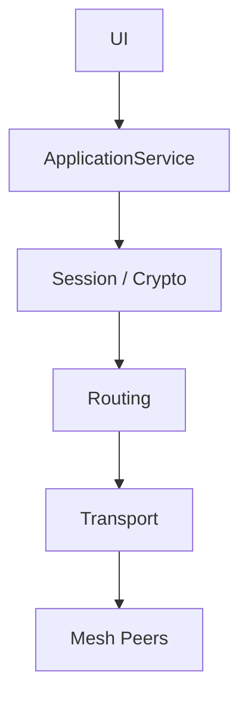
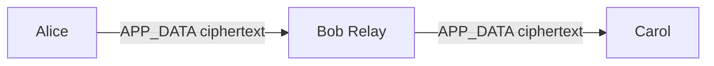
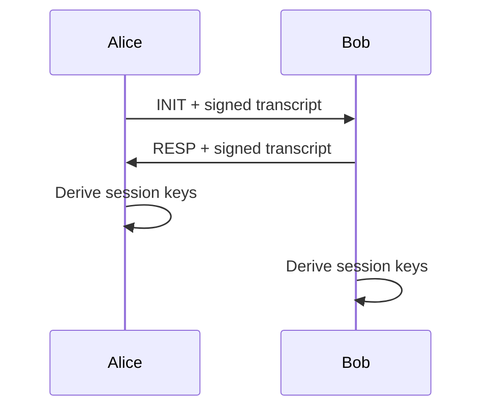

# M10.3 Presentation Outline
## Design and Implementation of an End-to-End Encrypted Messaging System over a Decentralized Mesh Network

### Slide 1 — Title
**Points**
- Project title
- Sanchay Jain
- B.Tech CSE project

**Recommended visual:** Alice–Relay–Carol mesh diagram.

**Speaker notes:** Introduce the problem as the combination of decentralized multi-hop communication and strict endpoint encryption.

### Slide 2 — Problem Statement
- Centralized messaging introduces concentrated trust and availability dependencies.
- Intermediate mesh nodes cannot be assumed trustworthy.
- Need secure multi-hop communication without exposing application plaintext to relays.

**Speaker notes:** State the engineering problem before discussing technologies.

### Slide 3 — Objectives
- Bounded managed flooding.
- Cryptographic identity.
- Authenticated session establishment.
- E2EE application messaging.
- Relay forwarding of opaque ciphertext.
- Security and performance validation.

### Slide 4 — Threat Model
**Mitigated**
- Tampering
- Replay
- Impersonation
- Malformed packets
- Resource exhaustion within implemented bounds

**Non-goals**
- Perfect anonymity
- Complete metadata hiding
- Guaranteed delivery
- Compromised endpoints
- Internet-scale DoS protection

### Slide 5 — Architecture

**Speaker notes:** Emphasize the separation between endpoint cryptography and routing.

### Slide 6 — Mesh Network
- TCP-connected peers.
- Peer lifecycle management.
- 4-byte length-prefixed framing.
- 64 KiB maximum frame.
- Bounded peer and queue resources.

### Slide 7 — Bounded Managed Flooding

- TTL
- Seen-cache
- `(source_node, packet_id)`
- No DHT
- No route-selection algorithm

### Slide 8 — Cryptographic Stack
| Purpose | Primitive |
|---|---|
| Identity | Ed25519 |
| Key agreement | X25519 |
| KDF | HKDF-SHA-256 |
| Encryption | ChaCha20-Poly1305 |

**Speaker notes:** Explain why each primitive exists rather than presenting a list of algorithms.

### Slide 9 — Secure Session

- Ephemeral X25519 keys
- Ed25519 transcript signatures
- Session ID from transcript hash
- HKDF directional keys
- TOFU limitation

### Slide 10 — Security Controls
- Runtime packet validation.
- AEAD authentication.
- Replay window.
- TTL enforcement.
- Duplicate suppression.
- Pending handshake bound = 10.
- Frame and queue limits.

### Slide 11 — Security Validation
M9 demonstrations:
1. Wrong PeerID
2. Ciphertext tampering
3. Replay
4. Invalid signature
5. Malformed packet
6. TTL
7. Duplicate suppression
8. Pending-handshake bound

M9.1 additionally established relay blindness.

### Slide 12 — Experimental Methodology
- Local loopback.
- Warm-up excluded.
- One-way application delivery latency.
- Application delivery throughput.
- Crypto microbenchmarks.
- OS-level resource measurement.

**Speaker notes:** Explicitly state that results are not WAN benchmarks.

### Slide 13 — Experimental Results
**1 KiB direct**
- Mean: 0.063 ms
- P99: 0.220 ms

**1 KiB multi-hop**
- Mean: 0.122 ms
- P99: 0.408 ms

**Throughput**
- 1,854 messages/s
- 5,000/5,000 delivered
- 0 loss / 0 duplicates

**Message size**
- 60 KiB tested successfully, 100/100

### Slide 14 — Limitations & Future Work
**Limitations**
- Loopback only
- No WAN impairment campaign
- No concurrent handshake scaling
- No AEAD decryption benchmark
- No CPU utilization percentage
- No perfect anonymity/metadata hiding

**Future**
- WAN tests
- Larger meshes
- Routing optimization
- Metadata protection
- Post-compromise security

### Slide 15 — Conclusion
- Working decentralized E2EE mesh prototype.
- Endpoint cryptography is separated from routing.
- Security controls were actively validated.
- Local performance baseline was established.
- Limitations and future research directions are explicit.

**Speaker notes:** End with the core architectural principle: the network can forward the message without becoming a trusted reader of the message.
